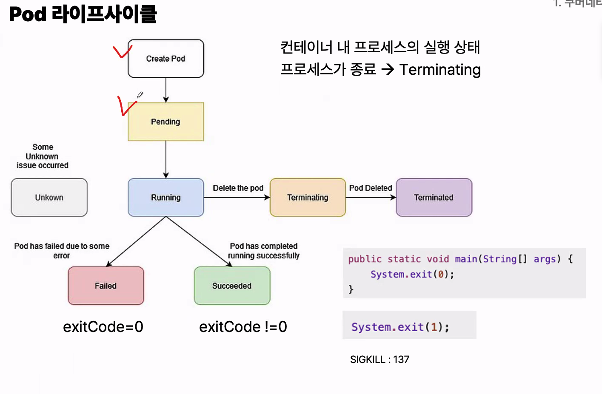
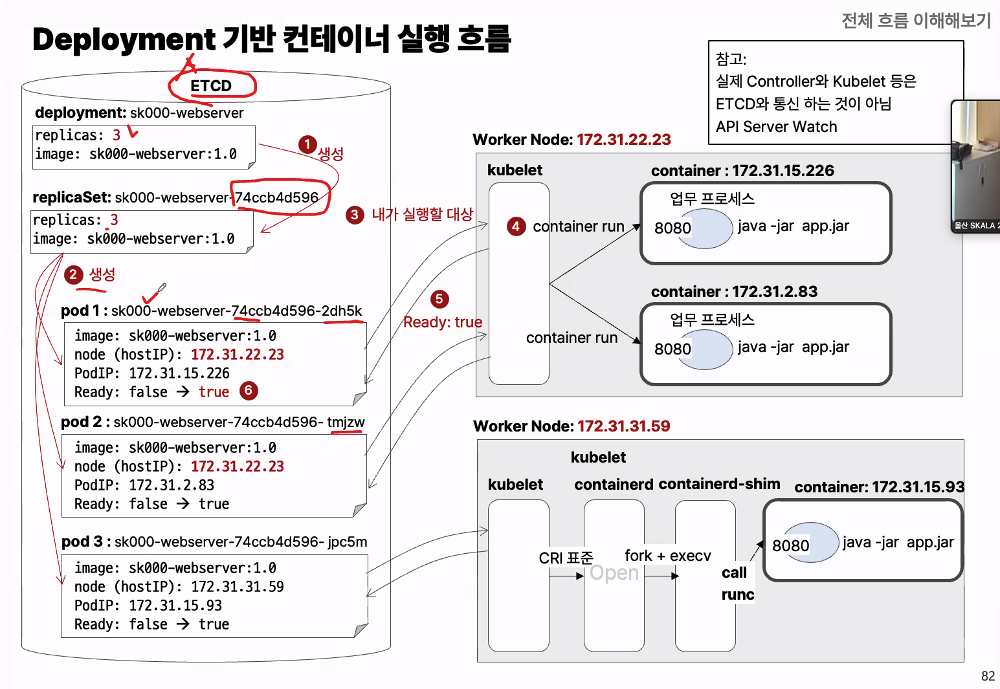
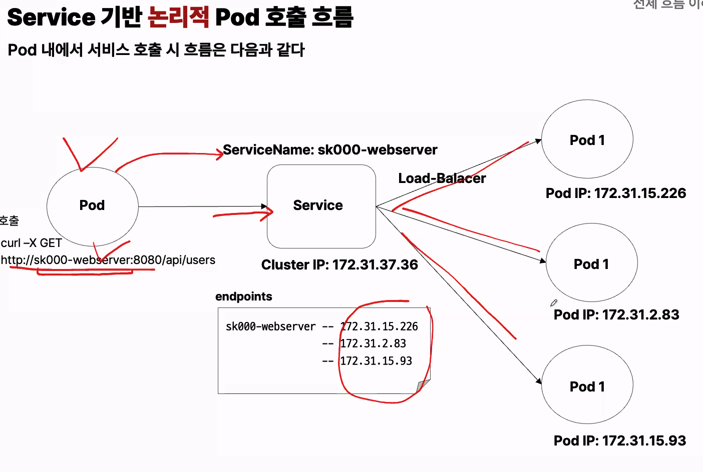

- 주의 : 업뎃햇는데 hTml이 안바뀜 -> 똑같은 인덱스로 되있어 캐시를 지우면 됨
- POD : 요청서를 통해 요청을 하면, 무조건 실행
  - 컨테이너를 실행시키기 위한 최소 단위
  - 
  - pause container
    - Pod 전용 linux namespace생성
      - network(하나의 컨테이너처럼 동작할 수 있게), UTS, IPC, PID, Mount, User
    - pod ip 유지 네트워크 인페이스(veth) 연결, 다른컨테이너들의 setns()로 들어올 수 있는 기준점 제공
- Depoyment
  - replicas
  - pod
- serivce
  - pod 집합에 단일 엔드포인트를 제공, 지속적인 통신이 가능하도록
  - stateless
  - endpoint
  - endpointslice
    - Service가 연결할 Pod가 많아졌을 때 Endpoints 하나로 전부 관리하면 갱신 비용이 너무 커짐
- namespace
  - 네임으로 공간을 나눈거, 리소스 이름 권한 정책 가시성을 서로 격리해서 관리, 자원이 섞이지 않고, 통신이 섞이기 않고 적용
- label과 selector
  - 리소스를 느슨하게 연결
  - 이 파드가 누구 소속인지, 이 서비스가 어떤 pod를 대상으로 하는지 메타데이터로 결정
- kubernetes cluster
  - kube-controller manager, cloud-controller,kube-scheduler, kube-api-server, etcl, kubelet, kube-proxy
  - admission control flow
    - api Http handler - uathn authz,- mutating admition- object schema validation - validating admission - persisting to etcd
- deployment 기반 컨테이너 실행 흐름
  - 
- service 기반 논리 pod 흐름
  - 

- kubernetes API
  - api 요청으로 사용

          Kubernetes API
              ├─ Core API
              │  └─ /api/v1
              │     ├─ pods
              │     ├─ services
              │     ├─ configmaps
              │     ├─  secrets
              |     └─ namespace
              │
              └─ API Groups
                  └─ /apis
                      ├─ apps/v1
                      │  ├─ deployments
                      │  ├─ replicasets
                      │  └─ statefulsets
                      │
                      ├─ batch/v1
                      │  ├─ jobs
                      │  └─ cronjobs
                      │
                      └─ networking.k8s.io/v1
                          ├─ ingresses
                          └─ networkpolicies

  - Core API는 오래된 핵심 리소스, API Groups는 이후 기능들을 영역별로 분리해서 독립적으로 버전 관리하려고 만든 구조.

- accounts : 토큰은 어떻게?
  - serviceAccount
    - secret : token, ca.crt, namespace
  - 실제로 마운트되는 과정
    - Pod가 생성될 때 serviceAccountName을 확인한다. 없으면 해당 namespace의 default ServiceAccount를 사용한다.
    - Kubernetes가 ServiceAccount용 인증정보를 Pod의 projected volume으로 구성한다.
    - 그 volume을 컨테이너의 /var/run/secrets/kubernetes.io/serviceaccount에 자동 마운트한다.
    - 컨테이너 안의 프로그램은 그 파일을 읽어 API Server에 HTTPS 요청을 보낸다.
    - API Server는 먼저 token으로 신원을 확인하고, 이어서 RBAC으로 요청 권한을 검사한다
  - 1. k apply -f serviceaccount.yaml → ServiceAccount 생성
  - 2. k apply -f sa-secret.yaml → service-account-token 타입의 Secret 생성
  - 3. Kubernetes가 그 Secret이 특정 ServiceAccount용이라는 걸 보고 token / ca.crt / namespace 값을 채움
  - 자동 마운트 = Pod가 쓰는 신분증을 Kubernetes가 잠깐 넣어주는 것
  - Secret 생성 = 그 ServiceAccount의 신분증을 클러스터 리소스로 따로 만들어두는 것

- RBAC
  - Role : 특정 리소스에 대한 접근 권한을 정의하는 객체, 특정 네임스페이스 내 권한, clusterRole: 클러스터 전역 권한
  - binding : 서비스 계정에 Role/clusterRole을 바인딩 하여 권한을 부여하는 객체
    - rolebinding : 네임스페이스 내로 제한, clusterRoleBinding : 클러스터 전역

- 파드별 권한을 제어하는게 중요한 이유 : ai, 에이전트가 만질때 주의하기 위해서

# 궁금한점

- 실제 쿠버네티스관리 하에서, 우리가 실제 관리해야하는 파일은?

YAML 파일들

deployment.yaml → 어떤 이미지로 Pod를 몇 개 띄울지
service.yaml → Pod들을 어떤 포트/주소로 연결할지
ingress.yaml → 외부 요청을 어떤 Service로 보낼지
configmap.yaml → 일반 환경설정
secret.yaml → 비밀번호/API Key 같은 민감정보
serviceaccount.yaml → Pod가 어떤 계정으로 K8s API에 접근할지
role.yaml, rolebinding.yaml → 그 계정의 권한
필요하면 persistentvolume\*.yaml, job.yaml, cronjob.yaml

- 쿠버네티스가 필요한 이유

예지보전 모델이나 RAG/Agent 프로젝트를 실제 서비스로 올린다고 하면, “모델 만드는 것” 다음 단계가 바로 Docker + Kubernetes Deployment + Service + 자원관리, 쿠버네티스는 AI 모델 자체를 만드는 기술이라기보다, AI를 실제 서비스로 안정적으로 굴리는 기술

    - Deployment: FastAPI/Triton/vLLM/Spring AI 같은 추론 서버를 여러 Pod로 띄우고 업데이트. 모델 버전 v1 → v2 롤링 배포도 여기서 처리한다. Deployment는 원하는 상태를 계속 유지해주는 컨트롤러다.
    - Service / Ingress: 여러 추론 Pod 앞에 고정된 접점을 만들어 사용자 → API → 모델 서버로 연결. Pod는 바뀌어도 Service 주소는 유지된다.
    - ConfigMap / Secret: 모델명, temperature, DB 주소 같은 설정은 ConfigMap, OpenAI 키·DB 비밀번호 등은 Secret.
    - PV/PVC: 모델 weight, 임베딩 인덱스, 데이터셋처럼 Pod가 죽어도 남아야 하는 데이터 저장.
    - Job / CronJob: 학습, 임베딩 생성, 평가, 배치 추론, 데이터 전처리처럼 끝나는 작업에 적합.
    - GPU / Resource requests & limits / QoS: AI에서 특히 중요. 어떤 Pod가 GPU를 쓰는지, CPU/RAM을 얼마나 확보할지 정해서 모델 서버끼리 자원 싸움이 안 나게 한다.
    - RBAC / ServiceAccount: AI Agent나 파이프라인이 K8s API, Secret, Job 등을 건드릴 때 어디까지 허용할지 제어.

- kubectl쓰면 되는데 왜 api호출을?
  - 평소 Kubernetes 조작은 kubectl이 API 구조를 대신 처리해준다.하지만 YAML 작성, 권한 설정, 문제 해결할 때는 API Group 구조를 알아야 한다.
