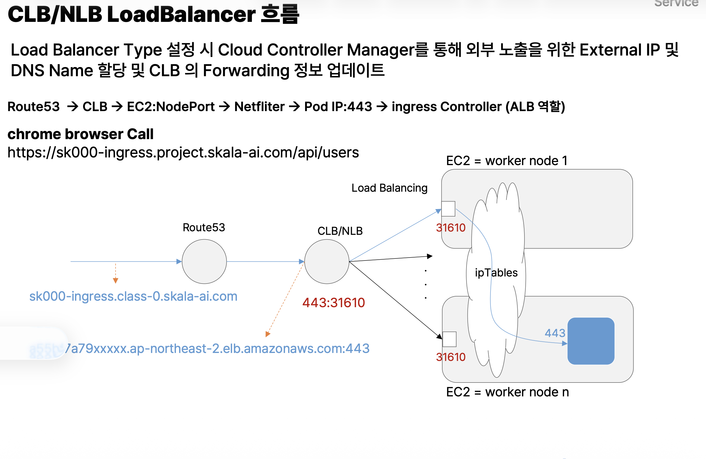

- pod argument 전달
  - command, args,
  - 환경변수 주입도 가능, (command : /bin/sh-c를 이용함) 컨테이너 실행시점에 주입
  - 보통 다른사람의 컨테이너를 자신이 쓸때 확장하는 용도
  - 참고
    - /bin/sh \_c 는 뒤에 오는 연결된 string을 command로 인식해서 주입해주게 됨. 그러므로 환경 변수로 인식 가능
    - exec를 사용하지 않으면 container 실행 시 sh 가 1번 프로세스로 생성되고 sh 의 child로 python3가 기동
    - exec를 사용하게 되면 python3를 바로 1번 프로세스로 동작하게 적용.
    - 이는 SIGTERM 등 signal 처리시 python3가 직접 받도록 지원 하여 안정적인 종료 처리 지원

- init 컨테이너
  - Pod의 실행되기 전 가장 먼저 초기에 실행되어 초기화 및 사전 작업을 수행하는 컨테이너로 Pod 내 포함
  - initContainers는 시작 조건, readinessProbe는 트래픽 수신 조건, emptyDir은 두 컨테이너 사이의 공유 저장 공간
  - initContainers
    - active.enabled 파일이 생길 때까지 대기
  - Main Container (webserver:1.0)
    - readinessProbe
  - Volume (emptyDir)
    - /root/active.enabled
    - 두 컨테이너가 공유
  - 실무 : initContainers를 우리가 만들고, 다른 개발자가 만든 메인컨테이너 연결

- side car
  - 일반적으로 공통 기능을 옆에 같이 포함 side car 시켜서 컨테이너의 안정성, 네트워크, 로그, 모니터링, 자가 복구를 지원
  - 일반적으로 Pod는 주 컨테이너 와 지원 컨테이너인 한 개 이상의 side car 컨테이너로 이루어져 있음
  - 같은 Pod에 있기 때문에 네트워크와 볼륨을 공유, 두 Container는 Network Namespace를 공유
  - Main Container: 비즈니스 로직만 담당
  - Sidecar Container: 프록시, 로그 수집, 모니터링 등 보조 기능 담당
  - Sidecar를 프록시로 사용하면 메인 컨테이너의 트래픽을 유연하게 제어할 수 있다
    - pod 내 주 컨테이너로 들어오고 나가는 모든 트래픽을 side car container인 proxy가 모두 통제함으로써 유연하게 트래픽 제어
    - Nginx에서 Spring Boot를 localhost:8080으로 호출 가능(Network Namespace를 공유하기 때문)
    - 외부에서는 Spring Boot를 직접 호출하지 않고 Nginx :80 Spring Boot :8080
    - Nginx에서 Header 추가, 로깅 같은 부가 기능을 수행
    - 기존 Service에서 targetPort: 8080을 targetPort: 80으로 변경하면 Nginx Sidecar를 거치도록 구성할 수 있음. Service의 selector는 기존과 동일하게 유지
  - 참고
    - | 구분      | 정적 파일             | 동적 데이터         |
      | --------- | --------------------- | ------------------- |
      | 예시      | HTML, CSS, JS, 이미지 | 사용자 정보, 게시글 |
      | 처리 주체 | Nginx                 | Spring Boot         |
      | DB 조회   | 일반적으로 불필요     | 필요할 수 있음      |
      | 응답      | 저장된 파일 반환      | 실행 결과 반환      |

- Deployment
  - replicaset :
    - rollingupdate(기본값)
      - maxSurge, maxUnavaliable
    - recreate방식
    - 블루그린
    - rollback
      - undo

- statefulset
  - pod가 자기 전용 저장 공간을 지녔을때
  - 각 pod를 고정된 이름으로 찾을 수 있어야함
  - 생성, 삭제 순서가 중요
  - Client 가 지속적으로 특정 Pod 와 통신해야 하는 경우
  - Node Failed 또는 Network 장애로 인한 실패 시(Unknown 상태) Pod A 0가 정상적으로 다른 Node에 Replace 안되는 현상 발생 할 수 있음
    - 기존 Pod가 정말 종료됐는지 Kubernetes가 확신할 수 없다
    - StatefulSet은 mysql-0이라는 고정된 이름을 사용하므로, 기존 Pod 객체가 남아 있는 동안 같은 이름의 Pod를 새로 만들 수 없음.
    - 따라서 강제 삭제 필요, 캐시 삭제
    - 핵심은 ReplicaSet은 Pod의 개수만 유지하면 되지만, StatefulSet은 Pod의 고유한 정체성까지 유지해야 하기 때문
  - rolling update 전환 방식
    - 기존 Pod를 삭제
    - 같은 ordinal 이름으로 새 Pod를 재생성
    - 새 Pod가 Running/Ready가 될 때까지 다음 Pod는 안 건드림
  - volumeClaimTemplates = StatefulSet용 “Pod마다 PVC 자동 생성기”.

- 스토리지
  - Storage = 실제 데이터를 보관하는 곳
  - Volume = 그 저장공간을 Pod에서 쓰게 연결하는 방법
  - PV = 지속 저장공간의 쿠버네티스 객체
  - PVC = Pod가 PV를 요청하는 객체

- headless service
  - k8s에서 클러스터 내에서 파드에 직접 접근할 수 있도록 해주는 서비스
  - clusterIP: None
  - statefulset에 servicName 에 이름 설정
  - StatefulSet의 serviceName은 Headless Service와 묶여서 각 Pod에 고정 DNS를 만들어 주고, 그 DNS를 쓰면 ClusterIP 로드밸런싱을 거치지 않고 특정 Pod로 직접 갈 수 있다.
  - Pod Name.Headless Service Name.NAMESPACE NAME.svc.cluster.local
  - StatefulSet의 각 Pod를 고정된 DNS 이름으로 직접 찾기 위해서 사용
  - 참고.
    - port-forward는 하나의 Pod에 임시 터널 여는거라 여려 pod 확인 못함

- service endpoint 수동 저장
  - subset
  - Kubernetes가 관리하지 않는 외부 서버나 레거시 서버를 K8s Service 이름으로 접근하고 싶을 때 사용
  - Service는 쓰고 싶은데 Kubernetes selector로 자동 대상 선택을 못 할 때, 목적지 IP를 직접 등록
  - 실무에서는 일반 Pod에는 거의 자동 Endpoint를 쓰고, 외부 시스템 연결·레거시 시스템·특수 라우팅 같은 경우에 수동 Endpoint

- node port
  - NodePort는 외부 접근을 위해 Kubernetes Node의 포트를 개방하는 방식
  - 클러스터 바깥에서 <NodeIP>:특정포트로 Service에 접근하게 해주는 Service 타입
  - 외부 데이터가 Worker Node의 NodePort로 들어오고, Node의 네트워크 규칙이 Service가 가리키는 Pod 중 하나로 바로 전달한다
- loadBalancer
  - 외부에서 접근 가능한 공식 진입점(External IP/DNS)을 만들어주는 Service
  - Node IP를 사용자가 직접 알 필요가 없게 앞단에 공식 진입점을 만들어주 것
  - 
  - LoadBalancer = NodePort 앞에 외부용 대표 주소를 하나 만들고, 여러 Worker Node 중 하나로 트래픽을 분산해주는 방식.
  - Service는 실제로 요청을 받아 처리하는 프로세스가 아니라, “이 IP/포트로 오면 어떤 Pod들로 보내야 하는지”를 정의한 논리적 객체
  - 간단버전
  - 설정은 Service 파일에 한다. 하지만 실제 외부 패킷을 받을 수 있는 건 IP와 NIC가 있는 Worker Node라서, Node의 포트를 입구로 사용하는 것(실제 서버는 노드)
  - ingress controller pod

- externaName
  - 클러스터 내부의 파드(Pod)가 클러스터 외부에 있는 외부 서비스(도메인)에 쉽게 접근할 수 있도록 DNS 이름으로 매핑해 주는 서비스

- 환경 변수 주입 방식
  - 환경이랑 컨테이너 분리
  - configmap
    - ConfigMap은 Key Value 형식의 설정 데이터를 저장하는 Kubernetes 객체
    - 볼륨 있이 vs 볼륨 없이
      - env 방식 = 설정값을 변수로 넣는다
      - volume 방식 = 설정파일 자체를 컨테이너 안에 꽂아준다
  - 환경 변수 주입은 실행 시점에 결정
    - 따라서환경 변수 변경 시 컨테이너 재 실행이 필수

# 궁금한점

- 도커파일의 cmd에 하는거랑 무슨차이 pod aug

Dockerfile의 ENTRYPOINT ["python"]은 그대로 쓰고, CMD만 바꿀 수도 있고 다 바꿀수도 있음

Dockerfile의 CMD = 이미지가 가진 기본 실행값, Kubernetes의 args = 그 기본값을 배포할 때 바꾸는 값.

- 왜 sh -c "exec 이걸 쓰는거야 그냥 어차피 파이썬이 1번인데, [파이썬]형태면, args만 바꾸면 되는거 아님?

이미 이미지가 ENTRYPOINT ["python"] 형태라면 굳이 sh -c "exec ..."를 쓸 이유가 없어. args만 바꾸면 돼.

그럼 sh -c "exec ..."는 언제 쓰냐면 쉘 기능이 필요할 때, ex) 환경변수

&&, $변수, 파이프 |, 리다이렉션 > 같은 건 shell이 처리해줘야 해서 sh -c를 씀

단, Dockerfile이 ENTRYPOINT ["python"]이 아니라 CMD ["python", "app.py"]만 있는 이미지라면 Kubernetes에서 args만 바꾸면 python 자체까지 덮어버릴 수 있어서 이 경우는 조금 달라. ENTRYPOINT와 CMD를 구분

- 그런데 어차피 이닛컨테이너가 실행되야 메인이 실행되는데 왜 readinessProbe 같은거 필요한거임?

핵심 차이

Init Container

- 메인 컨테이너를 시작해도 되는지 확인
- 성공하면 종료되고 다시 검사하지 않음

readinessProbe

- 메인 컨테이너 실행 후에도 주기적으로 검사
- 실패하면 Pod를 Service 트래픽 대상에서 제외
- 컨테이너 자체는 계속 실행

DB가 처음에는 정상이어도 실행 도중 장애가 발생할 수 있잖아.

Init Container는 이미 종료됐기 때문에 그 장애를 감지하지 못하지만, readinessProbe는 계속 검사할 수 있어.

결론: Init Container는 시작 전 한 번, readinessProbe는 실행 중 계속 검사한다

- Nginx 볼륨 마운트 정해져 있나? 정해진 경로 안에만 집어넣음?

ㅇㅇ 파일경로 막하면 파일 마운트 자체는 성공할 수 있지만, Nginx가 그 파일을 읽지 않아서 설정이 적용되지 않을 수 있어. Nginx 개발자들이 기본적으로 정해놓은 설정 파일 경로라 Nginx가 자동으로 읽는 거야.

- | 상황                                      | 사용하는 리소스 | 이유                            |
  | ----------------------------------------- | --------------- | ------------------------------- |
  | 일반적인 웹서버·API 서버                  | **Deployment**  | 복제, 자동 복구, 롤링 업데이트  |
  | DB처럼 데이터와 고정된 식별자가 중요할 때 | **StatefulSet** | Pod별 고정 이름과 스토리지 관리 |
  | 모든 Node에 하나씩 실행해야 할 때         | **DaemonSet**   | 노드별 로그 수집·모니터링       |
  | 작업을 한 번 실행하고 종료할 때           | **Job**         | 작업 완료가 목적                |
  | 정해진 시간마다 실행할 때                 | **CronJob**     | 주기적 작업                     |
  | 단순 실습·테스트                          | **Pod**         | 컨트롤러 없이 직접 실행         |

- Service는 실제로 요청을 받아 처리하는 프로세스가 아니라, “이 IP/포트로 오면 어떤 Pod들로 보내야 하는지”를 정의한 논리적 객체
- 설정은 Service 파일에 한다. 하지만 실제 외부 패킷을 받을 수 있는 건 IP와 NIC가 있는 Worker Node라서, Node의 포트를 입구로 사용하는 것(실제 서버는 노드)

- 노드를 넘겨갈때는 어떻게 이동함?
  - Worker Node끼리는 원래 네트워크로 연결돼 있고, CNI가 그 위에 “Pod끼리도 서로 통신할 수 있는 길”을 만들어주는 것.
  - iptables가 다른 Node의 Pod를 골랐다 → CNI가 그 Pod가 있는 Node로 데려간다
  - Node ↔ Node 연결 = VPC/LAN, 라우터·스위치 같은 기본 네트워크
  - Pod ↔ Pod 연결 = CNI가 Node 네트워크 위에 구성

- ingress controller pod?
  - Ingress 리소스를 해석해서 실제 HTTP 요청 수신, 라우팅, 로드밸런싱, TLS 종료를 수행하는 실행 주체
  - "이 요청은 /api네" → api-service로 보내자 를 수행하는 실행 주체가 Ingress Controller고, 그 프로그램이 Kubernetes에서 실행되는 형태가 Ingress Controller Pod
  - Ingress 없으면 서비스마다 NodePort를 뚫을 수 있고, Ingress 쓰면 보통 Ingress Controller 하나만 외부 노출하고 뒤 Service들은 ClusterIP로 숨긴다.
  - Ingress Controller만 외부에 NodePort/LoadBalancer로 노출하고, 뒤쪽 서비스들은 내부용 ClusterIP로 둔다. 그리고 Ingress Controller는 그 내부 Service 정보와 Endpoint 정보를 이용해서 최종 Pod로 보낸다.

kube-proxy = Service/NodePort 정보를 보고 각 Node의 iptables/IPVS 규칙을 만들어주는 놈

Netfilter = 그 규칙대로 실제 패킷을 보내는 놈

Ingress Controller = HTTP URL/도메인을 보고 어느 백엔드로 보낼지 판단하는 놈
