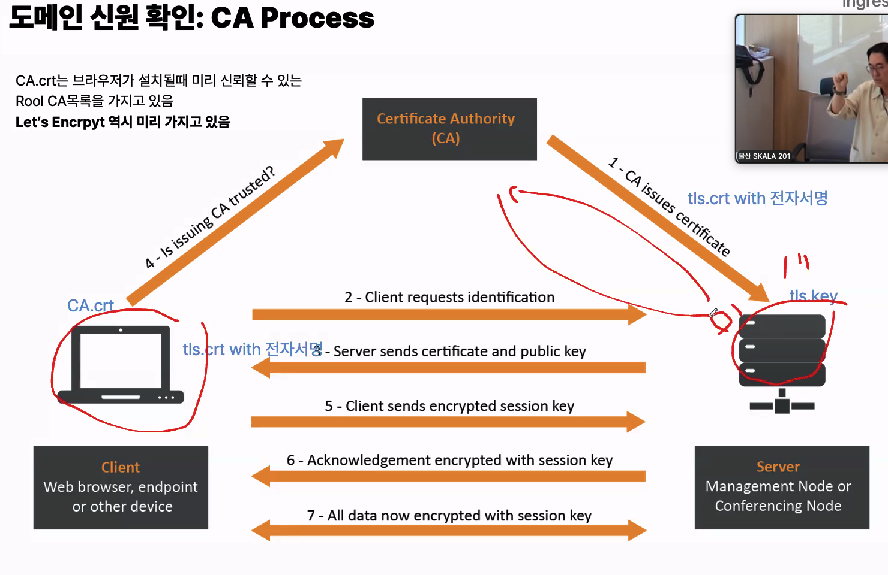

- secret
  - configmap이랑 똑같은 형태, 목적
  - Secret = 민감정보를 일반 설정과 분리하고, 별도 권한·암호화 정책·전용 기능을 적용하기 위한 객체
  - 데이터를 저장하는 형식 차이
    - base 64 secret(암호화와 관련 없음)
      - 모든 문자,특문 등 데이터에 대해 깨지지 않게 인코딩, 파서 충돌 방지
      - 실제 보안(암호화)는 etcd저장소 암호화와 RBAC접근 제어로 해결
    - 유형
      - Opaque : 내가 원하는 키밸류 지정
      - kubernetes.io/dockerconfigjson
      - kubernetes.io/tls
      - kubernetes.io/service-account-token
    - stringdata (내부적으로 인코딩해서 data로 해줌)(키, 밸류)

- V
  - 컨테이너가 데이터를 저장하고 공유할 수 있는 스토리지를 할당/연결한 단위
  - 지속적인 데이터 저장이나 여러 컨테이너 간의 데이터 공유가 필요한 경우 사용
  - 따라서 외부 기반은 연결하기 위한 권한,설정...이 필요함
  - emptyDir: {}

- PV 실제 스토리지를 가리키는 리소스
  - 스토리지는 진짜 저장공간. 예를 들면 AWS의 EBS 볼륨, EFS 파일시스템, NFS 서버의 특정 디렉터리 같은 것
  - PV 자체가 디스크는 아니고, 그 실제 저장공간에 어떻게 연결할지 적어둔 Kubernetes 객체야. PV를 “물리 디스크나 외부 스토리지를 추상화한 선언적 객체”, 즉 실제 노드에 마운트할 때 필요한 정보를 담는 객체
  - PV = 실제 저장소 연결 정보
  - PVC = 그 저장소 사용 요청/계약
  - volumes = 이 Pod가 어떤 PVC를 사용할지 지정, Pod가 사용할 볼륨의 출처 정의
  - volumeMounts= 그 볼륨을 컨테이너 어디에 보여줄지 지정
  - PVC가 Bound됐다고 바로 실제 스토리지가 Pod에 붙는 건 아니고, Pod가 어느 Node에 뜰지 결정된 다음 그 Node의 kubelet + CSI Driver가 실제 연결 작업

- EBS(RWO) : 블록 스토리지, 고성능·낮은 지연시간. 기본적으로 한 Node에서 읽기/쓰기하는 형태라 DB처럼 Pod별 독립 저장소가 필요한 경우에 잘 맞음. 그래서 StatefulSet + Pod별 PVC/EBS 조합을 많이 씀.
  - 주의 : 노드단위! 같은노드의 파드,컨테이너는 공유가능
- EFS(RWX) : AWS 관리형 네트워크 파일 스토리지. 여러 Node의 여러 Pod가 같은 저장공간을 동시에 읽기/쓰기 가능해서 Deployment 여러 replica가 파일을 공유할 때 적합.
- NFS (RWX): 이것도 네트워크 파일 스토리지라 여러 Node/Pod가 같은 파일을 공유할 수 있음. EFS와 개념은 비슷한데, EFS는 AWS가 관리해주는 파일시스템이고 NFS는 보통 직접 NFS 서버를 운영하거나 별도 NFS 스토리지를 사용하는 형태. 성능은 네트워크와 NFS 서버 성능에 영향을 많이 받아

- static provisioning : 관리자가 미리 PV를 수동으로 상성해 두고...
- dynamic provisioning : 사용자가 PVC를 만들면, k8s가 자동으로 PV를 생성하여 바인딩
  - 어떤 스토리지를 사용할 지 명시하기 위해 StorageClass를 지정하면 자동적으로 PV 생성

- Taint(테인트)와 Toleration(톨러레이션)은 특정 파드가 특정 노드에 배치되지 못하도록 거부하거나, 반대로 허용하는 스케줄링 제어 메커니즘

- 쿠버네티스에서 Pod를 특정 노드나 다른 Pod와 가깝게(동일한 위치) 또는 멀리 배치하기 위해 사용하는 고급 스케줄링 기능은 어피니티(Affinity)와 안티 어피니티(Anti-Affinity)

- HTTPS 기반 ingress
  - ingress는 외부에서 들어오는 http/https요청을 어떤 service로 보낼지 L7라우팅 규칙만 선언하는 리소스
  - 선언적 리소스
  - 작성한 Ingress는 “라우팅 설정표”이고, 이미 클러스터에 설치된 NGINX Ingress Controller Pod가 그 설정표를 읽어서 실제 요청을 처리
  - HTTPS
    - 사용자의 브라우저와 웹사이트 간의 통신에 사용되며 데이터 전송을 암호ㅗ하하여 보완을 강화
    - TCP 연결을 하고 처음엔 인증서/공개키로 서버를 확인하고 안전하게 키를 합의한 뒤, 실제 데이터는 빠른 Session Key로 암호화, TLS
  - 대칭키
    - 암호화와 복호화에 동일한 키를 사용하는 암호화방식, 빠른속도, 키관리 문제 AES...
  - 비대칭키
    - 공개키와 개인키
    - 공개키의 검증, 인증, 전자서명 필요(공공기관한테)
      - CA process
      - 전자서명은 내용과 해시코드를 개인키로 암호와하고, 공개키로 복호화하여 해시 비교

- 브라우저 → "https://example.com/api"
- LoadBalancer → Ingress Controller 쪽으로 전달
- Ingress Controller → 인증서(tls.crt/tls.key)로 HTTPS 처리 → /api 경로 확인
- Service → 맞는 Backend Pod 선택
- Pod→ 실제 요청 처리
  - 
  - CERT manager
    - Kubernetes 안에서 TLS 인증서 발급·갱신·Secret 생성을 자동으로 해주는 컨트롤러
    - ClusterIssuer: 어느 CA에, 어떤 방식으로 인증서를 요청할 것인가

- deploy 리소스의 liveness/readiness - kubelet이 감시
  - startupProbe : 2번 이상 실패시 종료
  - readinessProbe :2번 모두 실패시 endpoint제거
  - livenessProbe : 2버 이상 실패 시 종료

- Job은 하나이상의 pod를 실행해서 정해진 작업을 끝까지 완료하도록 보장하는 쿠버네티스 리소스
  - cronjob

- SecurityContext
  - Pod 또는 컨테이너 내에서 실행되는 프로세스의 보안 속성 및 권한을 정의하는 설정

- 노드의 상태를 확인 할려고할때 주로 host씀

- QoS Class : 각 pod에 대해 리소스 보장 수준을 정의하는 분류 체계
  - 자원이 부족할때 어떤 pod가 우선적으로 제거 대상이 되는지 결정하는 중요한 기준
  - Guaranteed : reqests와 limits가 모두 같은 값, 가장 높은 우선순위
  - bustable : requests와 limits가 둘다 있지만 값이 다르거나 requests만 설정한 경우,
  - BestEffort : 모든 조건 설정하지 않은 경우, 가장 낮은 우선순위
- Priority Class : pod의 우선순위를 정하는 메커니즘, value숫자로

- 참고.
  - 자동화 : 아르고CD, 젠킨슨

# 궁금한점

- ingress, 로드밸런서 차이
  - LoadBalance : IP/Port 기준으로 어디에 전달할지 결정하는 입구, 요청 내용 /api 같은 걸 신경 안 씀
  - ingress : Host, Path 같은 HTTP 정보를 보고 Service를 선택

                            ┌→ api-service → Pod
            브라우저          │
            ↓               │ /api
            LoadBalancer → Ingress Controller
                            │ /web
                            └→ web-service → Pod

    - 즉 LoadBalancer는 먼저 Ingress Controller를 외부에 노출하는 역할을 하고, 실제로 /api, /web 같은 걸 구분하는 건 Ingress Controller가 함

1. 브라우저가 https://도메인:443 접속
2. LoadBalancer가 Ingress Controller 쪽으로 전달
3. Ingress Controller가 tls.crt 제시
4. 브라우저가 CA 서명/도메인/유효기간 검증
5. Ingress Controller가 tls.key를 가진 정당한 서버임을 TLS 과정에서 증명
6. Session Key 합의
7. 이후 암호화된 HTTPS 통신
8. Ingress Controller가 /api 같은 경로 확인
9. backend Service/Pod로 전달

- NodePort 3XXXX이 Service YAML에서 이미 그 Service에 할당되어 있고, 그 Service가 선택하고 있는 실제 Ingress Controller Pod IP들 중 하나로 보냄
