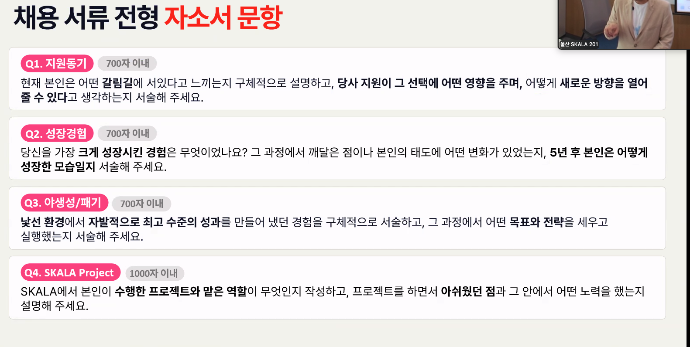
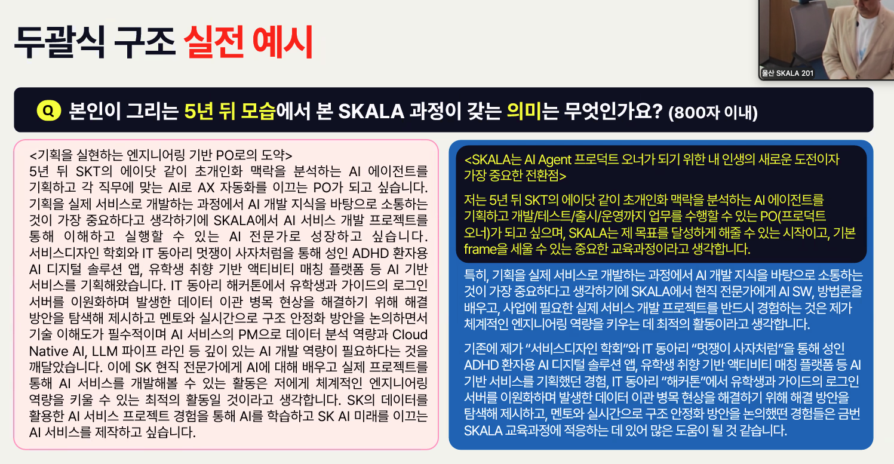
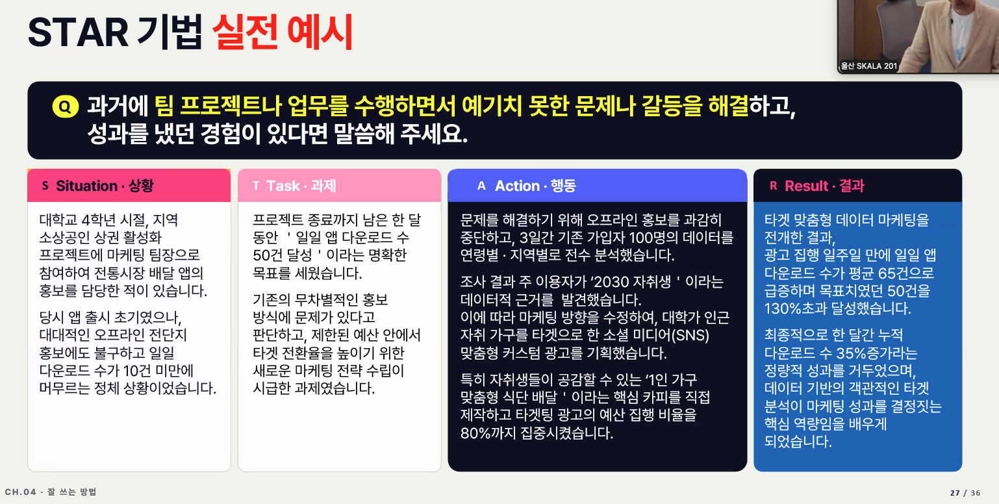
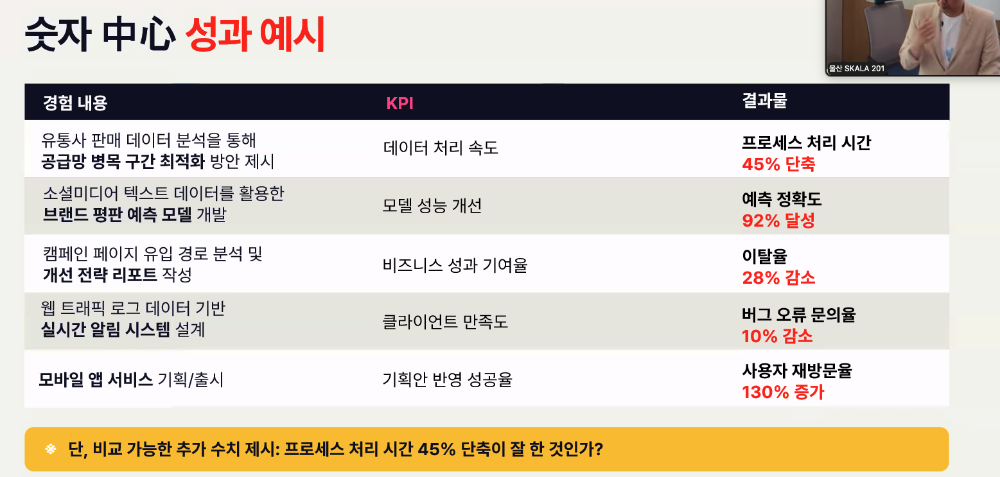

- 채용 트렌드
  - ai기반 스킬 중심 수시 채용, 문제해결력 중심(경력직)
  - 스킬기반 채용 - 증명된 스킬 및 포트폴리오, 적응력 및 성장 마인드셋
    - 단순 코딩 테스트가 아닌 오픈소스 활용 아키텍쳐 설계
    - 코딩 어시스턴트 활용 효율적 디버깅
    - 실제 현업 데이터 제공 후 1시간 이내 시장 진입 전략 보고서 도출
  - 다면 역량 구조화
    - 구체적 상황, 역경 과제
    - 해야했던일
    - 내가 했던일, 스킬/기술
    - 정량적/정성적 결과
  - 시뮬레이션 평가
    - ai를 활용한 소프트스킬 정밀 측정
      - 문제해결 알고리즘
      - 스트레스 내성
      - 의사 결정 패턴
  - 파이썬, 프롬프트 관리 등을 어떤식으로 활용할수 있고 실제 어떻게 적용했는지
  - 어디 프로젝트에서 효율 얼마나 향상했는데 어떤스킬로 어떤 과제를 수행해 어떤 성과를 했는지
  - 실제 프로젝트에서 내 기여도, 발생한 문제를 어떻게 해결했는지, 어떤 기술을 사용했는지
  - ai리터러시
    - 작동원리 이해/활용
    - 프롬프트 엔지니어링, 바이브코딩
    - ai결과물에 대한 검토, 편집 의사결정에 활용
    - ai를 레버리지로 3인분 아웃풋 -> 문제 해결형 전문가
    - ai를 어떤식으로 활용해서 어떻게 결과물을 냈는지
  - 풀스택 인재
    - ai로 1인당 생산성 높이는
    - 아이디어를 쏟아내는 사람, 진짜 제품으로 만드는 사람, 어질러진것을 치우는사람, 만들어진 제품을 시장에 맞게 키우는사람, 큰 시스템을 안정적으로 지키는 사람
    - 혼자 전 과정을 완결하는 인재
      - 직무 전문성+ai활용+데이터 기반 분석적 사고력을 통한 인사이트 도출
  - 조직의 문화에 무엇을 더해주는가? 새로는 시각-사고
    - 데이터 패턴 기반 최적 해법, 새로운 각도로 문제 직시
    - 기존 당연하게 생각했던 관행에 문제를 제기해 다른 대안을 제시했던 경험?
    - 우리팀의 전테 포트폴리오를 볼떄 당신의 어떤점이 팀 외연을 넓히는데 기여할수 있나요
  - 컬쳐핏보단 팀핏 : 팀의 페인 포인트를 집요분석 : 동질성보다 스킬/성향 퍼즐 조합 필요 : 한명한명이 독립 실행 가능한 유닛
    - 변화 속도가 빨라지고 정답이 없는 환경에서 일해본 경험?
    - 갈등 조율?

- 자소서
  - 열심히, 잘 은 도움안됨...
  - 스펙보다 자소서가 좀 더 중요 (3:7, 4:6 정도)
  - 스펙은 커트라인 기준치, 합격은 자소서
  - 직무경험, 지원 동기, 가치관-성격, 입사포부 비중이 큼
  - 감점 요인
    - 너무 짧거나 급하게 써서 무성의
    - 다른 회사이름이나 지원부서 잘못 적은 자소서
    - 근거 없는 역량의 과잉 기술
    - 빈약하고 불분명한 성과
  - 면접 질문 생성기, 면접관의 질문을 내게 유리한 방향으로 유도할 수 있는 트리거
  - 두괄식으로 정리된 자소서가 좋음
  - 지원동기, 성장경험, 야생성/패기, 프로젝트

- 좋은 자소서
  - Sitution, Task, Action, Result, 두괄식(결론 먼저, 그다음 근거와 사례 제시, 질문 내용의 총 결론을 첫번쨰 단락에 모두, 근거와 사례를 star기법으로 설명하기)
    
  - 기업명 오기제 확인, 글자수&오타검사(그렇다고 글자맞추느라 질문과 다른내용 X), 개인 신상 정보 누출 지양
  - 두괄식(+소제목:첫단락 요약들어가면서 임팩트 있게 작성하면 더 좋긴함), STAR, 객관적-수치화된 성과(비교가능한 수치 추가 필수, 성과 잘된거라는거 설명해줘야됨)
    
    
    
  - 성장과정(일대기나열보단 가치관직무연결), 성격장/단점(지원 직무 관련 무해한 단점 선별, 극복or 개선 사례 포함), 지원동기(지원 기업의 최근 구체적 사업분야, 성과 분석 결과 등과 개인경험-목표와 교집합 도출(입사포부때도 연계 활용 가능)), 입사 후 포부(단계적 설계 및 현실적이고 구체적 목표)

- 프로젝트 계획
  - 무슨 기술 스택? 어떤 결과물을 원하나? 계획 잘세우고 잘지켜지고있는지 항상 체크

- 입사 준비
  - 서류 작성시 집중적으로 봤던 체크리스트
    - ai가 작성하되 티안나게, 두괄식, 자연스럽게 가독성 좋게 읽히는지, sk냄새가 나도록(교수님이 중요하다고 한거에 따라, sk인재상이나 경영철학을 녹이도록)
  - SKCT
    - 많이 풀어보기, 취약부분 파악 채우기, 시간이 부족하기 때문에 모든걸 풀진말자, 자신있는 영역 확실하게 하는것도 좋음, 계산기를 빨리치는것도 좋음(넘버패드). 특강-요령, 수열은 규칙 많이 보기- 많이 풀수록 늠, 수리는 풀이법 몇초안에 안나오면 버리기, 추리도 경우의수 너무 많으면 버리기, 멘탈관리,
  - 영어면접
    - 말해보카?듀오링고? 직전에 비즈니스 영어 익히기, 솔루션 제안 장단점 설득 단어, 문장이 어느정도 정해져있음, 문제상황이 주어지고 솔루션을 만들어내서 설득하고 다른사람이랑 얘기
      - 문제상황 풀이, 메일보내기?, 대화하면서 제안하기
  - 면접관 내용 준비 어필
    - 프로젝트와 경험 위주, 경험마다 왜했는지, 어떤걸 얻었는지, 기술스택 본인수준, 본인이 생각하기에 기준이 먼지, 어떤경험이 있고 어떤식으로활용했기 때문에 상으로 표현했다 식
    - 자소서에서 질문이 시작되는것만큼 임팩트와 1분 자기소개서에 대한거에 대한 질문만 나올 수 있도록
  - 입사 자격증, 핵심 역량
    - 대화스킬, 면접연습을 많이 해라, 자신있는 프로젝트 하나 들고가는것 ㄱㅊ(페인포인트, 왜 이기술을 썻는지 이해관계자한테 설명)
    - 자격증은 역량이 받쳐주면 알아서 따라오는 것
- 자기 개발 우선순위
  - 기술 어학(말하기) 자격증
- sk핏에 맞는게 중요하다(패기 도전 열정), 거기에 맞는 사람이라는걸 어필
- 특정 요소, 기술만이라도 확실히 내것으로 만들자
