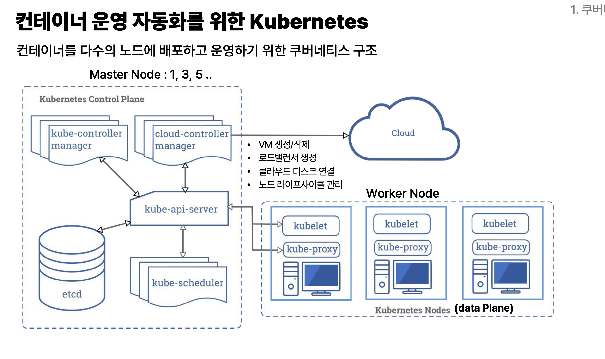
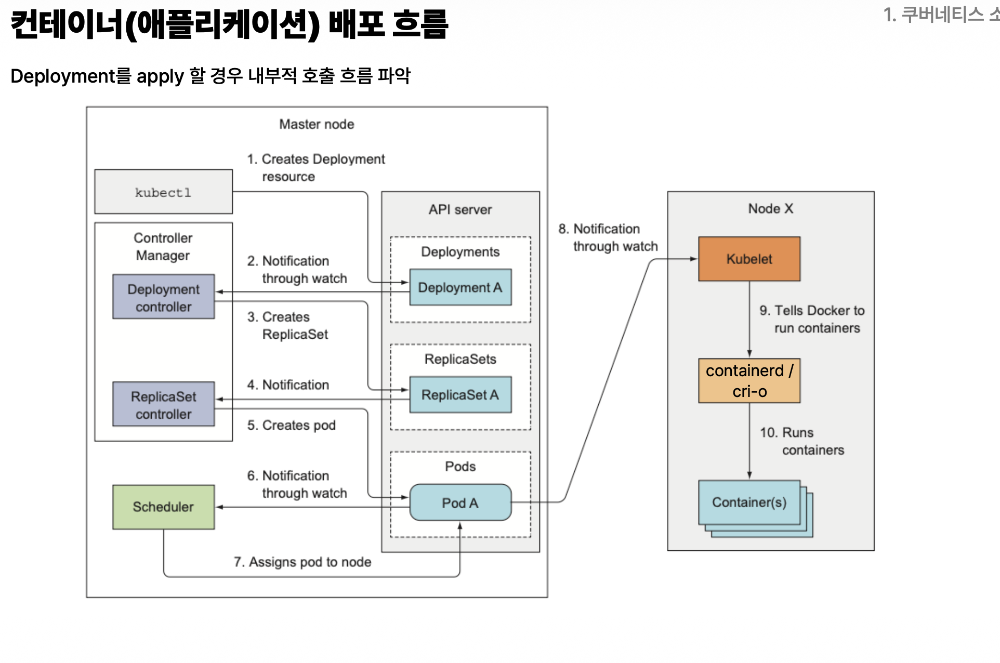

- 컨테이너 운영 자동화를 위한 요구사항
  - 원하는 상태를 선언하면 자동맞춤(declarativ)
  - 자가치우(self-healing)
  - 스케일링(수평/수직)과 오토스케일
  - 무중단 배포 전략 내장
  - 서비스 디스커버리와 로드밸런싱
  - 설정/비밀정보/정책관리
  - 스토리지 표준화
  - 관측성/운영 생태계

- 쿠버 네티스는
  - 요청 spec에 따라 실행 요청(controller)
  - 적당한 노드를 찾고(scheduler)
  - 컨테이너를 실행하고(kubelet)
  - 네트워크를 연결하고(kube-proxy)
  - 상태를 주기적으로 확인하고, 문제가 생기면 복구(controller)

- 비동기적 선언형 구조
- 마스터 노드
  - etcd : in memory형태로 저장되는 설정들
  - kube-scheduler
  - cloud-controller manager -> cloud
  - kube-controller manager
- 워커 노드
  - kubelet
  - kube-proxy

- manifest : 요청 선언/명세서, 원하는 상태를 작성한 명세, YAML or JSON
  - replicas, spec, image, port, ...

- 오브젝트, 리소스, manifest 차이
  - Resource = Kubernetes가 관리하는 자원의 종류/타입
  - Object = 그 Resource 타입으로 실제로 생성된 인스턴스, Kubernetes가 관리 중인 실제 상태까지 포함한 것
  - Manifest = “이런 Object를 만들어줘”라고 작성하는 명세서, 내가 원하는 상태

- spec : 사용자가 쿠버네티스에게 이렇게 되기를 원한다고 선언하는 목표/요구사항
- status : 쿠버네티스 시스템이 관찰하고 계산한 현재 상태, status가 spec을 따라 유지되는지 확인, spec으로 따르도록 지속적 조정

- pod
  - 배포할 수 있는 가장 작은 단위, 하나 이상의 컨테이너를 담을 수 있는 그릇
  - 보통 하나의 파드에 한개의 애플리케이션
  - create Pod -> pending -> running -> terminating -> terminated
    - failed, succeeded, unknown

  - pod 내 컨테이너 구조
    - 동일한 환경을 제공하면서 다소 격리된 상태로 유지
    - pause container
      - pod 전용 linux namespace생성
      - 네트워크 인터페이스 연결
      - pod ip 유지
      - 다른 컨테이너를 setns()로 들어올 수 있는 기준점 제공
      - 목적 : namespace 수명 = pod수명, 컨테이너 수명과 분리
    - 공유 네임스페이스
      - network(IP, 포트, localhost통신 공유, pause컨테이너 기준), UTS(호스트 네임, 기본 pod이름 및 도메인명), IPC(공유 메모리)
    - 격리
      - PID, Mount, User
    - pod.yaml
      - metadata : name, namespace,labels
      - spec : containers : name, image, imagePullPolicy, env

    - 참고 : 이미지를 업데이트하면 새 태그를 부여해서 “기존 이미지와 다른 버전”임을 명확히 하는 게 좋다 -> 업데이트

- service
  - 쿠버네티스에서 파드를 네트워크 상에 노출시키는 방법, 클러스터에 존재하는 IP주소
  - Pod(컨테이너)에서 단위에서 IP를 가지고 있고 동적 IP매핑 -> pod IP만으론 통신이 어려움
  - 서비스 네임과 클러스터IP로 통신
    - pod IP를 쓸수 없는 이유 = pod가 복제되서 여러개가뜸, 전체 pod대상은 여러개
    - 로드 밸런싱을 통해 서비스이름을 부르면 뒤에있는 pod중 하나를 호출
  - Service가 라벨을 기준으로 Pod를 선택하고(sellector:app에다 라벨을 붙임), 선택된 Pod의 실제 IP들을 Endpoint로 관리해서 트래픽을 전달한다.
  - 클라이언트 Pod는 Service 이름으로 요청하고, DNS가 ClusterIP를 찾고, Kubernetes 네트워크가 Service에 연결된 실제 Pod IP 중 하나로 요청을 전달한다.
    - ClusterIP = Pod들을 묶어 대표하는 Service의 내부 가상 주소
  - Pod IP들은 Service의 selector와 Pod label 매칭을 기준으로 EndpointSlice에 등록되고, 그 정보는 Kubernetes가 API Server/etcd 상태를 바탕으로 계속 갱신한다.
- deployment
  - 하나의 이미지를 가지고 여러개의 pod를 띄우기 위한 목적
  - 여러개의 pod를 관리하기 위한 상위 리소스
  - 파드 배포에 대한 원하는 규격을 선언 -> 상태 유지
  - 각 파드 이름도 관리하기 위해 필요함, -> 파드가 복제될때 적절하게 이름 충돌하지않게 적절하게 만들어줌
  - replica set controller을 통해 복제, 유지, 서비스가 중단없이 배포되도록 무중단 수시 순차 롤링 업데이트, 삭제
    - but 동시에 떳을때 문제 없는 경우만 가능
  - metadata.name은 리소스의 고유 이름
  - label은 리소스를 분류하기 위한 꼬리표 : 조회, 관리용
  - selector는 그 꼬리표를 보고 관리할 Pod를 찾는 조건
  - template은 앞으로 생성할 Pod의 설계도
  - containers[].name은 Pod 내부 컨테이너 이름

- ingress
  - 호스트이름과 패스로 서비스 접근
- configmap
  - 환경변수/설정파일을 컨테이너 실행 시 주입하기 위한 리소스
- namespace
  - 쿠버네티스에 자신의 애플리케이션을 배포했을 때 사용되는 리소스, 리소스 관리할때 네임스페이스 기준으로
  - Pod, Service, Deployment 같은 리소스를 Namespace별로 묶어서 관리
  - 애플리케이션 관련 리소스들을 특정 Namespace 안에 생성하고, 조회·삭제·권한 관리도 그 Namespace 단위로 한다

# 궁금한점

- 같은 이미지, 설정을 써서 컨테이너를 만드는 건데 컨테이너가 갑자기 종료되는경우가 왜 발생함?

이미지는 **“시작할 때 어떤 프로그램과 파일을 가지고 실행할지”**만 동일하게 만들어줄 뿐이고, 실행 중에 들어오는 입력·메모리 상황·외부 시스템 상태 등은 계속 달라져.

애플리케이션 자체 오류: 특정 입력에서 처리되지 않은 예외가 나서 Spring/Python/Node 프로세스 자체가 종료됨.
메모리 부족(OOM): 컨테이너가 사용할 수 있는 메모리를 초과하면 프로세스가 강제로 죽을 수 있음.
외부 의존성 문제: DB, Redis, API 등에 연결하지 못해서 프로그램이 종료되도록 작성돼 있을 수 있음.
노드 문제: 컨테이너가 실행 중인 서버 자체가 다운되거나 문제가 생길 수 있음.
Kubernetes가 의도적으로 종료: Deployment 업데이트, Pod 교체, 스케일 다운, liveness probe 실패 등으로 Kubernetes가 기존 컨테이너를 죽일 수도 있음.
사람이 종료: kubectl delete pod, docker stop 같은 명령도 당연히 가능함.

- 참고

  바닐라 Kubernetes = Kubernetes 자체
  벤더 Kubernetes = Kubernetes를 실제 기업에서 쉽게 운영하도록 특정 회사가 관리 기능과 인프라 연동을 붙인 것

- 흐름 정리

1. Registry에 이미지 준비
   sk117-webserver:1.0

2. webserver-pod.yaml 작성
   "이 이미지를 써서 Pod 하나 띄워줘"

3. k apply -f webserver-pod.yaml
   ↓
   Kubernetes API Server에 Pod 생성 요청

4. Scheduler가 실행할 Node 선택

5. 선택된 Node의 kubelet이 Registry에서 이미지 Pull

6. containerd가 컨테이너 생성/실행

7. Pod가 Running 상태가 됨

- Docker에서는 내가 직접 docker run으로 컨테이너를 실행했다면, Kubernetes에서는 Pod Manifest에 원하는 상태를 선언하고 kubectl apply하면 Kubernetes가 Node 선택, Image Pull, Container 실행까지 대신 처리한다.

- 서비스 포트를 나누면?

같은 Pod 안의 서로 다른 기능을 구분해서 접근하려고 포트를 나눈 것

- Kubernetes API Server가 REST API를 제공하고, kubectl은 그 REST API를 편하게 호출해주는 명령줄 도구

- 롤업 문제점
