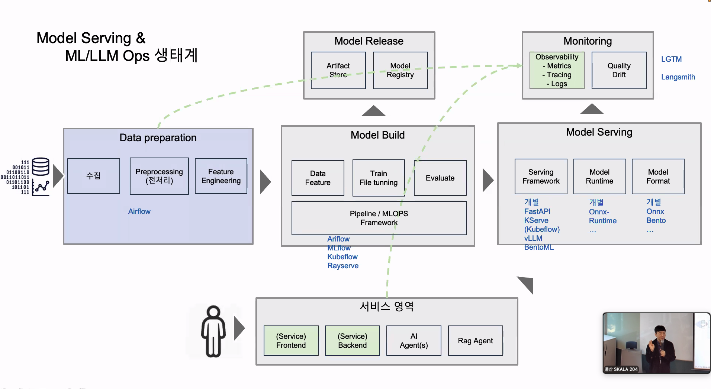
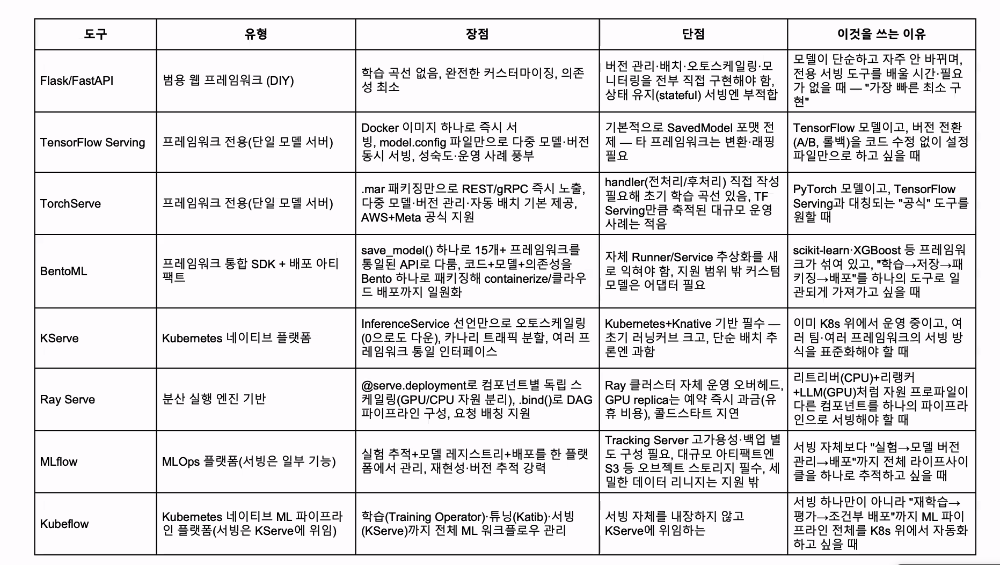

- Ops : 만들어 놓은 시스템을 실제 서비스 환경에서 계속 잘 돌아가게 관리하는 일
  - DevOps = Development + Operations → 소프트웨어 개발 + 운영
  - MLOps = Machine Learning + Operations → ML 모델 학습·배포·모니터링·재학습 운영
  - LLMOps = LLM + Operations → LLM 배포·프롬프트/모델 버전·평가·모니터링 운영
  - AIOps = AI + IT Operations → AI를 이용해서 시스템 운영/장애 탐지·원인 분석 등을 자동화
  - Ops는 개발과 운영을 연결해서 운영을 잘하자에 가깝고, AIOps에서는 특히 IT Operations 자체를 AI로 지능화·자동화하자에 방점이 찍혀 있음
    

- 배포 환경 단계 : 로컬(도커) - 개발계(깃헙) - 스테이지 - 운영계(쿠버네티스)
- 서빙 : 개발완 - 플랫폼 선택 - 등록/배포 - 호출/소비(실제 사용자가 호출할 수 있는 엔드포인트나 채널로 전달)
- 모델 서빙 : 모델 저장(bentoml.sklearn.ave_model) - 접근점 주석(service.py에서 predict를 @svc.api데코레이터로 노출) - 배포 빌드(bentofile.yaml) - 버전관리 서빙(bentomlserve)
- 모델 스토어 : 태그/버전으로 모델을 추적하는 저장소(저장시점마다 태그/버전, 조회, 최신화, 롤백 유용)
  - 학습/저장/실행(train_and_save.py) - 태그 자동 생성 - 저장소에 등록 - 목록 조회 - 정렬
- 배포 아티팩트 : 코드 모델 의존성을 하나로 패키징한 배포 단위(재현 가능한 아티팩트로 빌드, 버전관리/롤백 가능)
  - 서비스 지정(빌드할 서비스 위치지정) - 파일 범위 선언 - 패키지 선언(의존성 패키지) - 빌드 실행
- 모델 서빙 툴 : 이미 존재하는 다양한 오픈소스/상용 서빙 도구들 개관, 요구사항에 맞는 도구 선택
  - 프레임워크/트래픽 파악 - 단순 모델 검토 - 전용 도구 선택 - 패키징/구동
- REST APIs(FastAPI) : 앱/모델 초기화 - 스키마/엔드포인트 정의 - 요청검증/예측 - 응답 반환
- 모델 서빙 도구들
  
- ONNX : 프레임워크 간 모델을 교환하는 공통 저장 포맷, 워커 수로 동시성 처리 병목 줄이기
  - 학습 포맷은 모델을 만들고 저장하기 좋은 형태, 서빙 포맷은 완성된 모델을 빠르고 안정적으로 추론하기 좋은 형태, 그리고 ONNX가 둘 사이의 번역기 역할을 하는 대표적인 공통 포맷
  - 모델 로드 - 더미입력 준비 - export호출 - .onnx저장
- Bento : 모델 파일 뿐 아니라 실행 코드/의존성/설정까지, 선언 한번으로 패키징/조회/서빙
  - bentofile.yaml - bentoml nuild - 빌드 완료 확인 - bentomllist - bentomlserve
- 책임,경계 단위 분리 : 데이터 과학자, 엔지니어, ....
- 모델 versioning : 피처,데이터,성능까지 함꼐 추적하는 버전관리
- 서빙 철학 패턴 : stateless serving, continuous Model evaluation(모델 검증 계속), keyed prediction(병렬로 처리하는 요청-응답 매핑)
- 서빙 접근법 패턴 : 요구사항 파악 - 패턴 선택 - 필요시 조합
  - 모델을 어떤 전략으로 서빙할지 6 패턴 : batch, online, two-phase, pipeline, ensemble, business logic
- 배치 모델 서빙 : 인스턴스가 많을때 비동기 배치 단위로 서빙
- 온라인 실시간 추론 : 요청 즉시 동기 응답하는 배포
  - REST API : 자원을 URI, 조작을 HTTP 메서드로 표현 아키텍쳐
  - gRPC : proto로 인터페이스를 한 번 정의(스키마 정의)하면 여러 언어의 클라이언트/서버 코드를 자동 생성하고 HTTP/2기반으로 요청-응답-양방향 스트리밍
  - websocket : 클라이언트 요청 없이(폴링 없이) 서버가 먼저 데이터를 밀어보내야 하는 상황, 같은 TCP연결 유지, 양방향 채널 열기
- two-phase model serving : 엣지 경량 모델과 서버 정밀 모델의 이중 서빙
  - 네트워크 불안정해 무거운 서버의 모델에 항상 접근할수 없음 - 엣지에 경량 phase one 모델 배치
- Pipeline Model Serving : 복잡한 ML작업을 여러 단계로 쪼갠 서빙 구조
  - 데이터 수집 - 정제 - 특성 추출- 학습 - 테스트 - 저장
- ensemble Model Serving : 여러 모델을 함께 서빙 계층에서 배치 호출
- business logic pattern : 추론 이전 로직을 추론 서버와 분리 배포하는 패턴

- scikit-learn
- PyTorch
- tensorflow
- keras
- FastAPI(lifespan) : 재학습 없이 pickle.load()를 한번만 호출해 모든 /predict요청이 이를 재사용하게 한다

# 궁금한점

- 정리

Gradle = 애플리케이션 빌드 도구
BentoML = AI 모델을 서비스 형태로 패키징·서빙하는 도구
Docker = 그 결과물을 실행환경까지 묶는 컨테이너 도구
Kubernetes = 그런 컨테이너들을 운영하는 도구

- 코드는 lifespan 하나만 작성하지만, --workers 4로 실행하면 Uvicorn이 같은 앱을 4개 프로세스로 띄우고 각 프로세스가 그 lifespan을 한 번씩 실행한다.
