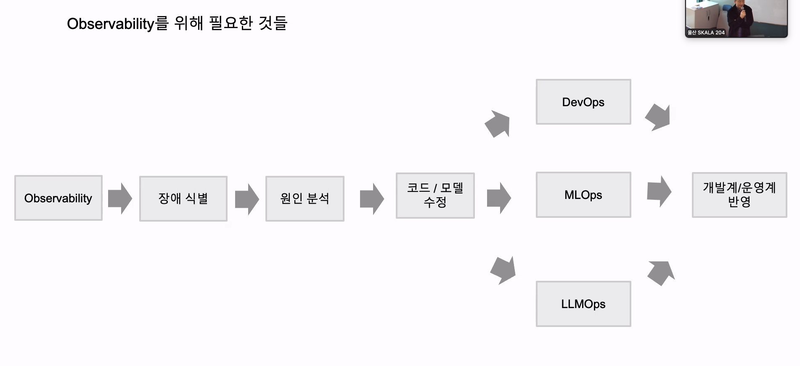

- MLflow : 실험 추적부터 모델 레지스트리까지 관리하는 오픈소스 MLOps플랫폼
  - MLflow Client(SDK) : tracking server와 통신하는 파이썬 라이브러리
  - MLflow tracking Server : REST API로 실험 기록을 받아 저장을 위임하는 중앙 서버
  - MLflow backend Store : 파라미터,지표,태그,run 메타데이터를 저장하는 DB
  - MLflow Artifact Store : 모델 파일 등 실제 산출물을 저장하는 오브젝트 스토리지 PVC
  - MLflow Model Resgistry : 등록된 모델의 버전과 별칭(Alias),태그를 관리하는 중앙 저장소
  - MLflow Model : sklearn, PyTorch 등 프레임워크별 flavor와 함께 pyfunc 같은 공통 flavor를 제공할 수 있는 표준 패키징 포맷이며, 이를 통해 프레임워크 차이를 감추고 공통 predict() 인터페이스로 로드·서빙할 수 있다.
  - MLflow Projects : MLproject 포맷으로 코드/환경/엔트리포인트를 재현 가능한 실행 단위로 패키징
  - MLflow Deployment 대상 - 등록된 모델을 로컬/Docker/K8s/클라우도 관리형 중 골라 서빙

- AIOps를 위한 준비
  - 관측 가능성 : 메트릭/로그/트레이스로 GenAI파이프라인 내부를 재구성하는 능력
  - Three Pillars : 로그/메트릭/트레이스, 관찰 가능성의 세 핵심 신호, 메트릭으로 이상을 감지하고 트레이스로 어느구간에서 지연/실패했는지 좁힌뒤, 로그로 그구간에서 정확히 무슨일이 있었는지 확인하면 문제를 좁혀 나간다
  - 모니터링 : 알려진 메트릭을 임계값 기반으로 감시하는 반응적 방식
  - MTTR : 인시더트 발생부터 해결까지 걸리는 평균 시간
  - 메트릭 : 라벨로 enrichment되는 수치데이터, 라벨 기반 집계 필터링 조기 탐지
  - 로그 : 비구조화 문자열로 남는 상세 이벤트 데이터, 구조화된 로그로 검색 효율 개선
  - 트레이스 : 요청이 여러서비스를 거치는 경로를 기록한 데이터, 요청 전체 경로를 시간순으로 재구성, Trace_id= 요청 하나 전체, Span_id = 그 요청 안의 개별 작업 단위
  - OpenTelemetry(Otel) : 로그/메트릭/트레이스 계측을 표준화 하는 오픈소스 프레임워크, 하나의 계측 코드로 여러 관찰 가능성 백엔드에 데이터를 보낼수 있음, 트레이스 메트릭 로그의 생성 내보내기 수집을 표준화, 여러 서비스에서 발생하는 로그·메트릭·트레이스를 표준화해서 수집하고 연결한 뒤, 원하는 관측 시스템에 전달하기 위한 공통 관측 데이터 파이프라인.

- LGTM
  - LGTM스택 : Loki,granfana,Tempo,Mimir 통합 관측 가능성 플랫폼,
  - Prometheus : 다차원 데이ㅓ 모델과 PromQL을 갖춘 오픈소스 모니터링 알림 시스템
    - PromQL로 다차원 질의를 수행하며, Aletmanager로 알림 규칙을 실행하고, Grafana등오로 시각화하는 파이프라인을 표준화된 오픈 소스 조합으로 구축
  - Exporter : prometheous가 긁어가도록 메트릭스를 노출하는 대상
  - grafana : 여러 데이터 소스를 한 화면에서 시각화하는 통합 관찰가능성 허브, 대시보드
  - grafana Alloy : OTel Collecter 배포판이자 prometheus 파이프라인을 내장한 통합 에이전트
  - Loki : 로그 본문은 놔두고 라벨만 인덱싱하는 로그 스토리지
  - LogQL : 스트림 셀렉터로 좁히고, 라인필터로 거르고, 파서로 구조화해 하나의 집계까지 이어지게 만든다
  - Tempo : 오브젝트 스토어 기반, 분산 트레이스(Trace)를 저장하고 조회하는 백엔드
  - TempoQL : 템포의 스팬 검색 집계 쿼리 언어
  - Mimir : Prometheus 호환 대규모 확장형 메트릭 저장소

- DevOps
  - 개발과 운영을 하나의 순환
  - DORA metrics : 데브옵스 지표(배포 빈도, 변경 리드 타임, 변경 실패율, 서비스 복구시간)
  - Continuous Integration (CI) : 코드 변경을 자주 병합/검증
  - Continuous Delivery(CD) : 테스트된 소프트웨어를 배포 준비 상태로
  - Infrastrucure as Code(IaC) : 인프라를 코드로 다루기
  - Configuration as Code(CaC) : 설정 값을 코드 아티팩트로 관리

- MLOps: 데이터/모델을 코드와 동등하게 다르는 데브옵스 확장(자동화, 버전관리, 실험추적, 테스트, 모니터링, 재현성)
  - 피쳐 스토어 : 피처, 훈련, 추론 파이프라인을 잇는 공유 저장소(저장, 버전관리, 추적, 일관성)
  - ML 메타데이터 스토어 : 실험/파이프라인 실행 이력을 기록해 계보를 역추적 가능하게 하는 저장소, API로 정확히 역추적
  - Orchestrator : 여러 ML 파이프라인을 자동화, 스케줄링, 조정하는 시스템, 자동화/스케줄링

- LLMOps : MLOps위에 구축된 LLM 특화 운영, 파인튜닝, 프롬프트엔지니어링, RAG 최적화 쉽게 프롬프트 모니터링/버저닝, 가드레일 피드백 루프 ..같은 관행 추가
  - 파인튜닝, 프롬프트엔지니어링, RAG
  - 가드레일 : 입력/출력 가드레일로 유해정보 차단
  - 다층방어 : 입력 가드 - 컨텍스트 격리 - 권한 제한 - 출력가드 - 도구 가드 - 감사/평가 루프
  - 휴면 피드백

- AI Ops : 머신러닝/빅데이터 분석을 IT운영 자동화에 적용하는 실천, 다양한 소스의 신호를 자동 상관분석해 노이즈를 줄이고, 자동발견/베이스라이닝/이상탐지/근본원인분석/원격조치까지 수행해 문제를 예방적으로 다룸
  - 자동 발견 : 시스템이 모니터링 대상을 사람 개입없이 스스로 찾아내 후속 자동화 단계가 다룰 데이터 범위를 확보
  - CMDB : 구성 요소 간 관계를 조회 가능하게 기록/관리하는 데이터베이스
  - 베이스라이닝 : 정적 임계값대신 정상 범위를 자동 학습해 알림을 검
  - 이상탐지 : 정상범위를 벗어난 값만 포착(z score기준)
  - 롤링 윈도우 : 최근 N개 구간만 슬라이딩하며 계산, 최신화 유지
  - 이동 평균: 롤링 윈도우 구간의 산술 평균
  - RCA : 인시던트의 근본 원인을 찾는 과정분석, 인시던트의 후보원인과 관련커밋까지 자동으로 제시

# 궁금한점

- PyTorch → 실제 학습
- Airflow → 학습 파이프라인 orchestration
- MLflow → 실험/모델 기록

- 모델 산출물 = 학습된 모델 자체
- artifact = 모델을 포함한 모든 결과 파일

- “지금 시스템 상태가 얼마나 안 좋은데?” → 메트릭
- 요청 하나의 전체 이동 경로를 추적 → 트레이스
- 개별 사건을 문장/이벤트 형태로 기록, "무슨 일이 있었지?” → 로그

- Prometheus → 메트릭 수집 + 짧은/중간 기간 저장 + PromQL
- Mimir → Prometheus 메트릭을 대규모/장기간 저장
- Tempo → Trace를 저장하고 조회하는 시스템
- Loki → Log 저장/조회
- Grafana → 이걸 한 화면에서 보여주는 도구.

- Prometheus는 LGTM에서 Mimir로 들어갈 메트릭을 수집하는 앞단 수집기 역할로 자주 같이 쓰이는 도구

# 실습

- mlflow.xxx()를 호출하면, 현재 Run과 연결된 형태로 파라미터·메트릭·아티팩트·모델 등을 MLflow Tracking Server에 기록/등록하도록 요청하는 것
- Alloy는 Grafana Labs가 만든 observability 수집/라우팅 에이전트, 여러 서비스에서 나오는 로그·메트릭·트레이스를 받아서 필요한 곳으로 보내주는 중간 허브

- Tempo = 요청 흐름(trace)을 저장하는 시스템

- trace 수가 30보다 많은 이유 = 네가 보낸 /checkout 요청뿐 아니라 Prometheus의 /metrics scrape 요청도 자동계측되어 trace로 기록됐기 때문

                      checkout-app
                          │
              ┌────────────┼────────────┐
              │            │            │
            Metric        Log         Trace
              │            │            │
              ↓            ↓            ↓
        Prometheus      Alloy        Alloy
              │            │            │
      remote_write        ↓            ↓
              │           Loki         Tempo
              ↓          로그 저장     트레이스 저장
            Mimir
          메트릭 저장

                └──── Grafana가 모두 조회

- AIOps는 관측 데이터를 보고 끝나는 게 아니라, 서비스 상태를 자동으로 발견하고, 정상 기준을 만들고, 이상을 찾고, 원인을 추정하고, 안전장치 아래에서 조치까지 연결하는 운영 자동화 흐름

- LGTM = 데이터를 모으고 보는 관측 계층

- AIOps = 그 관측 데이터를 이용해서 자동 판단 + 원인 분석 + 조치하는 계층
- AIOps는 우리가 실습에서 직접 구현한 운영 분석/자동화 기능들을 플랫폼 수준에서 제공해주는 것에 가깝다. 다만 데이터 연결, 정책 설정, 가드레일 설계는 여전히 사람이 해야 한다.

      1. 수집 설정
      2. 탐지/알림 규칙
      3. 서비스/토폴로지 설정
      4. 자동조치 워크플로
      5. 권한/가드레일 설정
      6. 대시보드/배포 설정
