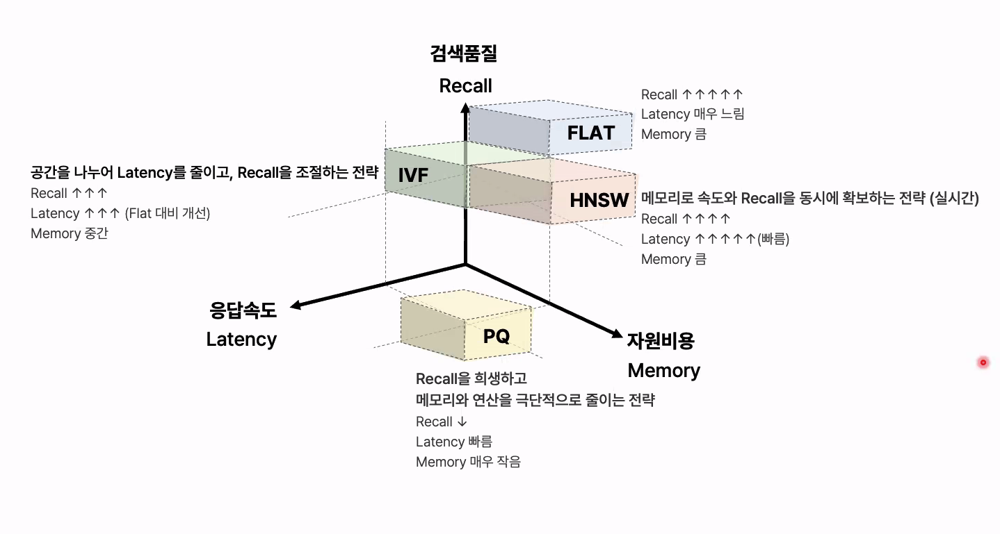

- 문서를 어떻게 자를까 → 어떻게 벡터화할까 → 어떻게 잘 찾을까 → 찾은 결과를 어떻게 정제할까 → 답이 진짜 좋은지 어떻게 측정할까 → 부족하면 Agent가 어떻게 스스로 다시 검색하게 할까

- 문서를 가져온다 → 잘 읽고 → 잘 자르고 → 벡터화하고 → 저장하고 → 질문을 벡터화해서 → 적절한 검색 전략으로 관련 문서를 가져오고 → 그 검색기가 실제로 좋은지 평가한다.

# --------------

- ai 적용 시 일반적인 고민
  - 보안 및 적합성, 비용, 부정확한 결과

- RAG : 기업 내부의 지식에 기반한 시스템이 필요
  - 검색 기반 증강, 모듈화된 구조(Retriever, generator), 효율적인 확장성
  - 사내 문서 체계의 비일관성, 비정형 데이터 처리 난이도 문제
  - 정보누락 : 정보없음을 명시적으로, 프롬프트로 조정
  - 검색된 문맥에서 답 추출 실패 : 데이터 전처리 : 중복 제거, 불필요내용 제거..
  - 출력 형식 오류 : 문서 전처리 파서
  - 불완전 응답 : 명시적 스키마, output validator
  - 대규모 데이터 처리 부담 : 분산 처리, 배치 설계, 사전 필터링
  - 코드 실행의 보안 위협 : 실행 제한 설정(권한, 환경..), HITL적용, 로그 모니터링, 랭체인으로..
  - PDF정보 추출 한계 : 다양한 파서 통한 실험, 사내 문서 구조 정규화 필요
  - 대규모 운영 안정성 확보 위한 벡터 레이어 도입, 초기구조가 스케일을 고려하지 못해 재구축 필요, 평가기준 마련

- 유저 쿼리, 데이터 인덱싱 - retrieval(질문 벡터화, 유사도 기반) - generation(프롬프트 전달)
- preprocessing
  - document Loader : RAG 시스템이 필요로 하는 데이터를 외부 소스로부터 효율적으로 수집하고 준비하는 단계, 데이터 필터링과 전처리
    - 원형 그대로?, 메타 데이터는 어디까지?, 읽는 속도는?
  - text Splitter : 큰 문서를 llm이 받아들일 수 있는 효율적인 작은 규모의 조각으로 나누는 작업
    - 문서 구조를 파악하고, 어떤단위로 나눌지 결정, 청크 사이즈 선정, 청크 오버랩
    - 토큰화 -> 청킹(모델 입력 제한 기준) vs 청킹 -> 토큰화(의미 기준)
    - 청킹 방식 : fixed size, recursive(\n\n, \n, 공백 같은 형식적 구분자를 보고 자름), document-based(짧은 문서 전체를 하나의 청크), semantic(문장의 의미 벡터를 비교해서 주제가 변하는 지점을 보고 자름), llm-based, late(검색 이후에 필요한 부분만 분할), hierarchical(문서에서 상위 청크(섹션)와 하위청크(문단)를 동시에 생성하고, 검색시 계층적으로 활용, 문서의 목차/구조 관계를 보존해서 묶음)
    - 메타데이터 태깅(수정일자, 문서접근 권한 검색필터링 시 활용)
    - baseline : 페이지 단위 -> 결과 기반으로 분할 전략 확정
      - 표, 문단이 페이지 경계에 잘리는지 사전확인, 페이지에 걸쳐 주요 키워드가 걸쳐있는지 사전확인
    - heading 기준으로 청킹 시에는 상위 섹션 경로를 메타데이터로 저장
      - 출처 추적, 검색 정확도 향상, heading이 불명확하거나 평면적 문서(스캔, 표지형)는 효과 제한적
    - 표는 캡션까지 묶어서 처리, 각주는 분리
    - 줄바꿈 하이픈 복원, 유니코드 정규화, 글자 꺠짐 확인, 영역 crop(영역 헤더,풋터 정보 검색 노출 제거)
    - 차트/표 잔여 텍스트가 본문 노이즈가 될 경우 : 글자수 필터링
    - 다단/복잡 레이아웃은 읽기 순서에 맞춰 분리
    - 표 데이터가 핵심이면 전용 도구로 별도 추출
    - 파싱 후 품질 검증 필수
  - 복잡한 표, 파싱 전략
    - pdfPlumber(단순표), OCR + Clustering(스캔표), VLM(중첩표)

  - 복잡한 문서 구조 : 교차잠조, 단서/예외, 시점, 정의 참조, 준용
    - 규칙 기반 계층 파싱(정규식 기반)
    - LLM기반 구조화
    - 참조 그래프
  - 임베딩 모델 선택 : 도메인, 언어..
  - vector index
    - flat, ivf, HNSW, PQ
    - 검색품질(recall), latency, memory
      
  - 벡터 스토어
    - faiss, milvus(대규모), qdrant(실시간 벡터), chroma(중소규모), pinecone(대규모 클러스터 확장 가능)

- retriever
  - 사용자의 질문을 벡터 형태로 변환(문서 임베딩과 같은모델)
  - 벡터 유사성 비교(cosin similarity, MMR), 상위 문서 선정, 문서정보 반환
  - ParentDocumentRetriever, MultiQueryRetriever, EnsembleRetriever
  - hybrid Retriever
    - sparse + dense : 키워드 중심 검색 + 문장 의미 중심 검색
    - BM25, SPLADE
  - B.reranker : 검색된 문서 중 질문에 더 직접적으로 답하는 문서를 다시 정렬
    - 속도가 중요하면 retrivever, 정확도가 중요하면 reranker

- prompt : 지시사항, 질문, 문맥
- llm : 참고. 모델 하드코딩 안하는게 좋음
- chain

- 평가 방법
  - retrieve
    - Hit rate@k(상위k개의 검색결과 안에 정답문서가 포함되어 있는가), mrr(정답문서가 검색 결과의 몇번째에 나오는가)
    - 평가 데이터셋 : 정답 청크를 llm에게 주고, 해당 내용으로 답할 수 있는 질문을 생성
    - 내 데이터에 적합한 retrieve는 무엇인가를 확인
  - generation
    - llm as a judge (relevance, ....)

- 요약 기반 문서 검색
  - llm기반,
    - chain of density
  - map-reduce, map refine,
  - 요약 방식
  - stuff, refine(청크들 순차적으로 처리하여 최종), reduce(각 청크의 요약을 병렬처리한 후에 결합)
