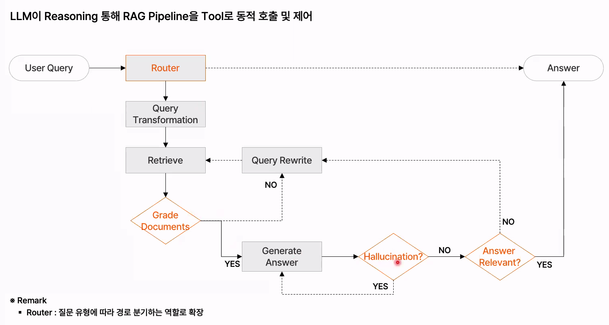

- naive rag 한계
  - 쿼리에 대한 얕은 이해, 쿼리와 문서 청크 사이의 의미론적 유사성이 항상 일치하는게 아님, 의미론적 유사성이랑 의도 적합성이랑은 다른문제
  - 정보 과잉이 부르는 할루시네이션 :중복되고 노이즈가 많은 정보는 방해
- advanced rag
  - retrieval 이전 이후 정교화
    - indexing : hierarchical structure, semantic chunking
    - Pre-Retrieval : qurery Rewrite, Query routing, Qurery Expansion, Query Transformation
    - retrieval : hybrid , multi hop
    - post retrieval : reranker, reorder

- Hierarchical Structure는 제목→소제목→문단→문장 같은 계층을 반영해서 저장하는 방식
- Semantic Chunking은 길이가 아니라 의미 변화 기준으로 청크를 나누는 방식
- Query Rewrite는 질문을 더 명확하게 다시 쓰는 것
- Query Routing은 어느 데이터소스/검색기로 보낼지 정하는 것
- Query Expansion은 관련 키워드를 추가하는 것
- Query Transformation(Query Decomposition)은 복잡한 질문을 sub-query 등 다른 형태로 바꾸는 것
- Hybrid Retrieval은 BM25 같은 키워드 검색과 Dense Vector Search를 결합하는 방식
- Multi-hop Retrieval은 여러 문서를 단계적으로 연결해서 한 번의 검색으로 답하기 어려운 복합 질문을 처리하는 방식
- Reranker는 “어떤 문서가 질문에 더 중요한가?”를 다시 평가해서 순위를 바꿈
- Reorder는 “LLM에게 어떤 순서로 보여줄까?”를 조정하는 것
- Compressor로 핵심 문장만 추출하거나 요약해서 노이즈를 줄이는 방식도 있음

- advanced rag 한계
  - linear structure rag : 모든 단계를 잘해야함, 이전단계로 되돌아가기 어려움
  - 속도/비용/효율

- self-Rag
  - reflection token통해 검색 필요성을 스스로 판단하고, 검색된 데이터랑 답변, 최종까지 평가하여 재시도도함(무한루프 빠지지않게 설정조절)
  - 한계 : 속도/비용, 단일 llm기반, 다단계 추론 외부도구 연동 불가

- Corrective RAG
  - Hallucination 문제를 해결
  - 검색 평가기(Retrieval Evaluator), 웹 검색 통합(Web Search Integration), 분해-재구성 알고리즘(Decompose-then-Recompose Algorithm)
  - Self-Correcting 매커니즘 도입 : 모델이 스스로 검색 결과의 품질을 평가하고, 필요 시 추가 검색 수행하여 생성의 정확도 개선
  - 검색 결과의 효율적 활용 : 분해-재구성 과정 통해 검색된 정보의 활용도 극대화

- Adaptive-RAG
  - 질의 복잡도 기반 동적 전략 선택 : 질문의 복잡도에 따라 적절한 검색 및 생성 전략을 선택하여 효율성과 정확성 향상
- Graph RAG
  - 문서 안의 개체(Entity)와 관계(Relation)를 그래프로 만들어서 검색하는 RAG
- Modules
  - rag를 기능 블록, 모듈로 나누고 그 블록들을 조합하여 사용하는 구조
  - 패턴
    - linear 패턴 : 쿼리, (프리)리트리브(포스트), 제너레이트
    - routing 패턴 : 질문의 특서오가 조건에 따라 가장 적합한 rag흐름을 선택하는 분기 구조
      - Qurery Routing : retrivev source, flow, config, model, prompt template, post-retrieve
    - branching 패턴 : 유저 쿼리를 여러 변주를 줘서 생성후에 합침
    - loop 패턴
      - interactive loop : 고정된 횟수 n만큼 반복
      - recursive loop : judge결과 따라 query transformation 수행
      - adaptive loop : judge가 루프 진입 여부 자체를 판단
  - 한계
    - 실시간 시스템 적용할 경우 latency 발생, 전체 시스템 평가 부족
    - 좋은 응답인지 판단하는 judge or Verification 모듈의 기준이 설계자 주관적이나 llm의존적

- Agentic Rag
  - agent 통해 검색 전략을 스스로 설계하고, 도구를 선택하며, 응답을 생성하기 위한 최적 흐름을 능동적으로 제어하는 구조
  - 이 질문에 어떤 도구, 데이터가 적절한가를 에이전트가 판단하고 선택
  - 패턴
    - reflection : 자기평가
    - planning : 과거경험(Memory), 실패로부터의 학습(Reflection), 외부도구 활용해서 계획 수립
  - 아키텍쳐
    - 멀티 에이전트 레그
    - hierarchical : 에이전트 간 계층 구조(master agent = supervisor), 명확하고 체계적인 흐름에 좋음, 복잡한문제는 동적상태 기반 구조로 확장 필요, 병렬 처리 문제
    - agentic corrective
    - adaptive
      
  - 한계
    - 설계자 의도 반영, 루프 종료 조건, 실제 에이전트간 협업은 제한적, 신뢰판단 등이 에이전트 스스로 판단하는게 한계, 에이전트가 자동으로 판단하고 흐름을 바꾸기 때문에 예측 불가능성 증가, 과거 경험은 반영하나 지속적으로 유지하는것은 여러움

- Langraph
  - state
    - 노드 간 연결성과 판단을 위한 핵심 데이터 구조, 노드간에 정보를 전달할 떄 state객체에 담아 전달
    - 데이터 공유, context 유지, 흐름 유지
    - 어떤 값을 저장할지 정의, TypedDict, reducer
  - node
    - state를 입력받아 변경된 키만 부분 업데이트(dict)를 반환
    - 어떤 기능을 수행할지 함수로 정의
  - edge, conditional edge
    - 조건 판단 함수 : 반환값 = 다음 노드 키, exit조건 명확히 설계

# 궁금한점

- Query Transformation(Query Decomposition), Multi-hop차이

Query Decomposition = 처음부터 큰 질문을 여러 작은 질문으로 쪼갬
Multi-hop = 첫 검색 결과를 이용해서 다음 검색을 이어감, 순차적 의존성이 더 강함

- self rag, corrective rag 차이

Self-RAG는 모델이 답변 생성 과정 전체에서 스스로 점검. Reflection Token을 써서 검색이 필요한가?, 검색된 문서가 관련 있는가?, 생성 답변이 문서로 뒷받침되는가?, 최종 답변이 유용한가?를 계속 평가. 즉 검색 전 + 검색 후 + 생성 후까지 자기검토
Corrective RAG는 특히 검색 결과가 잘못됐거나 부족할 때 어떻게 교정할지에 초점. 검색 결과를 Correct / Incorrect / Ambiguous처럼 평가하고, 문제가 있으면 질의를 고치거나 재검색하거나 웹검색 같은 외부 소스로 넘어가는 구조.

            | 구분 | Self-RAG | Corrective RAG |
            |---|---|---|
            | 핵심 | **자기검토(Self-Critique)** | **검색 오류 교정(Correction)** |
            | 평가 범위 | 검색 필요성, 문서 관련성, 답변 근거성, 답변 유용성 | 주로 검색 결과의 품질 |
            | 대표 동작 | Retrieve? / IsREL? / IsSUP? / IsUSE? | Correct / Incorrect / Ambiguous 판단 |
            | 문제 발생 시 | 재검색, 재생성 | Query 수정, 재검색, Web Search |
            | 초점 | 생성 과정 전체를 스스로 감시 | 나쁜 검색 결과를 보정 |

- 처음에 바로 Query Transformation을 거는 Linear 방식 vs 루프 패턴 방식

            | 상황 | 더 적합한 방식 |
            |---|---|
            | 질문 구조가 명확하고 빠르게 처리해야 함 | **처음 Query Transformation** |
            | 검색해봐야 부족한 정보가 뭔지 알 수 있음 | **Recursive Loop** |
            | 쉬운 질문/어려운 질문이 섞여 있음 | **Adaptive Loop** |
            | 같은 질문을 여러 번 재시도하면 개선 가능 | **Interactive Loop** |

  - 그냥 두개 합치면 안되나?

  둘을 합치면 검색 품질은 좋아질 수 있다. 하지만 매번 처음부터 Transformation을 하고, 실패할 때마다 또 LLM 호출 + 검색 + 생성 + Judge를 반복하니까 latency와 비용이 올라감.
