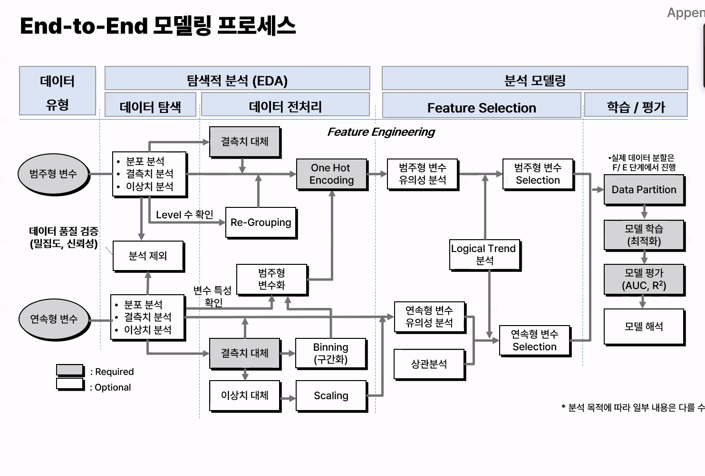
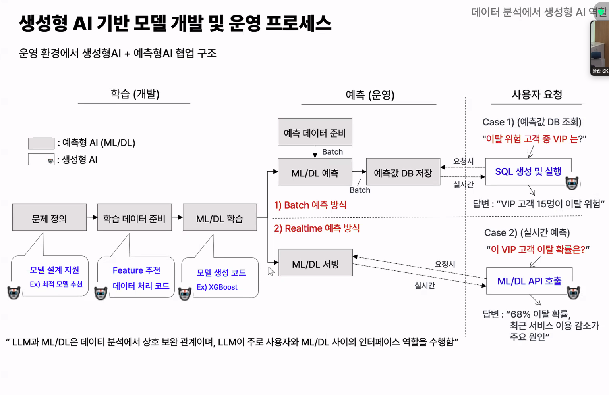

- 실무에서 많이쓰는 요소
- 비즈니스 이해, 타겟 정의, 피쳐도출이 데이터 분석의 핵심!
- 데이터 분석 프로세스(자기만의 프로세스 정립하기)
  - 비즈니스 이해, 데이터 준비, 데이터 전처리, 모델링, 모델 평가, 모델 적용
  - 분석주제, 타겟 정의, 피쳐도출, 분석요건 정의(모집단설정, 기간, 분석기법), 분석 모델링....
- 분석 기간 종류 : 관찰기간(모델성능에 영향 미침), 기준일, 예측 기간
- 데이터 특성 이해
  - 정형(피쳐 엔지니어링+ML) 비정형(파인튜닝,DL), 사이즈((작으면-복잡도 낮은모델, 비지도학습, 룰베이스), (크면-모델보다 학습/추론 인프라, 자동화 설계 중계)), 배치(일정주기로 데이터 대량 처리-복잡한 모델과 피처 사용 가능), real-time(모델 정확도 보다 응답시간, 운영안정성이 더 중요).
- 데이터 준비(가장 시간 많이 걸림)
  - 데이터 구축 프로세스
    - 데이터 정제, 변환, 통합
  - 데이터 품질 점검이 진짜 중요!(데이터를 봤을때 어떤 측면으로, 어떤 관점으로 바라볼지에 따라 분석가의 역량이 차이남)
  - 데이터 준비, 데이터 전처리, 데이터 랭글링(샘플링, 스케일링, 미싱, 아웃라이어...)
- 피쳐 엔지니어링
  - 원본 데이터를 모델 성능에 도움이 되는 형태로 가공하는 모든 과정
  - 모델에 도움이 되는 한 어떤 요소도 피쳐가 될 수 있음
  - 피쳐 추출
    - 피쳐 트랜스폼 : 기계적,수학적 추출, 사람의 해석 없이도 생성 가능한 피쳐
    - 파생변수생성!! : 도메인 지식 기반 추출, 창의력
  - 피쳐 개수가 너무 많을 경우? : 차원의 저주(차원이 늘어날수록 필요한 데이터가 기하급수적으로 늘어남(밀집도가 낮아짐)) -> 피쳐 샐렉션, 디멘션 리덕션...
  - 도메인 지식, 경험 및 사례로 후보 피쳐 생성 -> 데이터 기초 탐색으로 데이터 신뢰성 검증, 통계/ML 분석으로 피쳐 중요도 검증, 업무 논리적 판단에 의한 검증(Logical trend 분석), 최종 피쳐 선정
  - 논리성 검증 + 모델 변별력 + 모델 안정성
    - Logical trend분석은 변수의 영향 방향과 크기가 비즈니스 측면에서 논리적으로 맞는지를 검증
    - 변별력이 있나
    - 시간 등에 따라 피쳐가 얼마나 안정적이냐도 봄
- 모델 개발 -> 모델 운영
- 데이터 분할
  - 크로스 밸리데이션 (K-fold cross validation, Stratified K-fold(원본 클래스 비율 유지))
  - 샘플링
    - 랜덤 샘플링 : 샘플에 포함될 확률을 동일하게 추출
    - 테스트 셋은 그대로 두고 트레인에만 추출
    - 오버 샘플링, 언더샘플링
- 모델 최적화
  - 하이퍼 파라미터 조정, 성능향상, 일반화 향상, 효율성 증가
  - 데이터 전략
    - 트레이닝 데이터 디자인(모집단, 샘플링, 파티션), 피쳐 엔지니어링(파생변수, lag변수)
  - 모델 전략
    - 모델 셀렉션, 하이퍼 파라미터 튜닝, 레귤라이제이션, 앙상블
    - 하이퍼 파라미터 튜닝
      - 그리드 서칭(정의된 범위 내 모든 조합전수 조사), 랜덤 서치(정의된 범위 내 무작위 조합 샘플링), 배이전 서치(이전 결과로 다음 최적점을 예측)
      - 수작업 튜닝도 하는 이유 : 결국 트레인 데이터셋에서 튜닝을 해서 테스트 데이터셋에서 보장이 안됨(오버피팅)
    - 오버피팅
      - 트레인/테스트 비유사도, 데이터 건수, 피쳐 개수, 알고리즘 복잡도 등에 영향
      - 그래도 결국 테스트 데이터셋 정확도가 중요
    - 데이터 리키지
      - 모델이 예측 시점에 알수없는 정보를 학습에 사용한 경우
      - 데이터 설계, 처리 및 분할 할때 실수할 가능성
- 모델 평가 지표, 비교할 베이스라인or나이브 모델 필요
  - class : 혼동행렬
    - accuracy : 전체중에 올바르게 예측한 비율
    - recall : 실제 1중에 예측 1의 비율(1-recall : 실제 양성 중 놓친 비율) : 미탐
    - precision : 예측 1중에 실제 1의 비율(1-precision : 양성 예측 중 틀린 비율) : 잘못 예측했냐
    - F1 : precision 과 recall의 조화평균
    - 프리시전과 리콜은 트레이드오프의 관계
  - probability
    - ROC,AUC : 분류 임계값을 0부터 1까지 변화 시키면서 모델의 성능을 종합적으로 평가하는 지표
    - LIFT : 전체 집단에 비해 특정 집단의 예측력이 향상된 정도, 예측 score상위고객을 선별하여 업무에 활용할때 유용, 상위K건의 positive 비율이 무작위 대비 몇 배인지 나타내는 지표
    - AUC로 전체 집단의 모형 성능을 평가하고, LIFT로 관심 집단의 성능을 평가
  - 일반적으로 많이 : Accuracy, F1, AUC
  - 특정 목적 : Precision, Recall, LIFT
  - 회귀 : MAE, MSE, RMSE, MAPE, R-Squre
    - MAPE : 오차의 절대값을 실제값으로 나눈후 모두 더한 다음 데이터 크기로 나눈값
      - 문제 : 실제값이 0일때 계산불가, 데이터값이 매우 작을때 상대적으로 큰 오차, 무한대 발산
    - sMAPE : 실제값과 예측값의 차이를 두 값을 평균으로 나누어 대칭적인 오차 계산
    - MAE : 오차의 절대값을 모두 더한 다음 데이터 크기로 나눈값
    - R^2 : 독립변수가 종속변수를 얼마만큼 설명해주는지를 가리키는 지표
      - 1에가까울수록 성능이 좋고, 음수값은 Y평균값으로 예측한것 보다 못함
- 모델 해석
  - XAI
    - SHAP : 각 특성이 예측 결과에 기여한 정도를 게임 이론으로 계산
      - feature importance, feature impact, feature dependence
- 모델 모니터링
  - Model Drift : 학습 환경과 운영환경의 차이로 시간이 지남에 따라 모델의 성능이 저하되는 현상
    - 데이터 드리프트
      - 데이터의 통계적 분포가 학습 시점과 비교하여 유의미하게 달라지는 현상(연령분포, 환경변화, 유입..)
      - 피쳐 변경 없이 가중치만 조정 Re-training - 피쳐 계수 변경
    - 프레딕션 드리프트(모델출력의 변화)
      - 예측값의 통계적 분포가 달라지는 현상, data drfit, concept drift가 발생했을 때 그 결과
      - 의사결정 위한 예측 확률 기준값 조정, Threshold Adjustment - threshold 조정
    - concept drift(데이터 관계의 변화)
      - 입출력 관계의 변화
      - 거시 환경 변화, 비즈니스 프로세스 변경...
      - EDA부터 피쳐 생성 등 모델 재구축, Re-modeling

- AutoML : 분석 자동화 분석 워크플로의 전체 또는 일부를 자동화
- 분석가는 비즈니스, IT와의 협업 역할이 더욱 강조되는 방향으로 변화

- 참고. 모델 평가 암 예측 모델의 정확도는 95% 이다 라고 할때 그 정확도 산출대상이 되는 데이터 셋은?

test가 맞으나 실제로는 Test 결과를 본 뒤에 “조금만 더 튜닝해보자”가 반복되면서 Test가 사실상 Validation처럼 오염되는 경우가 꽤 있음.

그렇게 되면 그 Test 성능은 더 이상 완전히 독립적인 최종 성능이라고 보기 어렵다. 엄밀하게는 새로운 holdout test set을 다시 만들어야 최종 성능을 제대로 말할 수 있음.

정확도 보고도 비슷. 실무나 논문/보고서에서 Validation 94%, Test 95%처럼 둘 다 보여주기도 하고, 여러 fold의 validation 평균을 대표 성능처럼 말하기도 함. 그래서 “정확도 95%”라는 문장만 보면 어느 데이터셋 기준인지 반드시 확인.

# 실습

- 고객 이탈 예측 모델 생성/ 고객 이탈 요인 분석(gpt이용)

| Dataset        |   Accuracy |         F1 |        AUC |
| -------------- | ---------: | ---------: | ---------: |
| **Train**      | **0.9341** | **0.8505** | **0.9796** |
| **Validation** | **0.8452** | **0.6199** | **0.8585** |
| **Test**       | **0.8381** | **0.5904** | **0.8426** |

| 순위 | 변수                     | Importance |
| ---- | ------------------------ | ---------: |
| 1    | **Age**                  | **32.18%** |
| 2    | **NumOfProducts**        | **12.88%** |
| 3    | **Balance**              |  **9.95%** |
| 4    | **EstimatedSalary**      |  **9.74%** |
| 5    | **CreditScore**          |  **9.66%** |
| 6    | **accountDuration_days** |  **9.16%** |
| 7    | **IsActiveMember**       |  **7.58%** |
| 8    | **Geography**            |  **4.38%** |
| 9    | **Gender**               |  **3.26%** |
| 10   | **HasCrCard**            |  **1.21%** |

특히 Age + NumOfProducts + IsActiveMember는 Importance와 실제 Target 관계를 같이 봤을 때 상대적으로 해석 가치가 높은 변수들

EstimatedSalary, accountDuration_days처럼 모델 Importance는 높은데 Target과 단순 관계가 약한 변수

| Model        | Validation AUC |   Test AUC |
| ------------ | -------------: | ---------: |
| RandomForest |         0.8585 |     0.8426 |
| XGBoost      |     **0.8756** | **0.8515** |
| LightGBM     |         0.8592 |     0.8335 |
